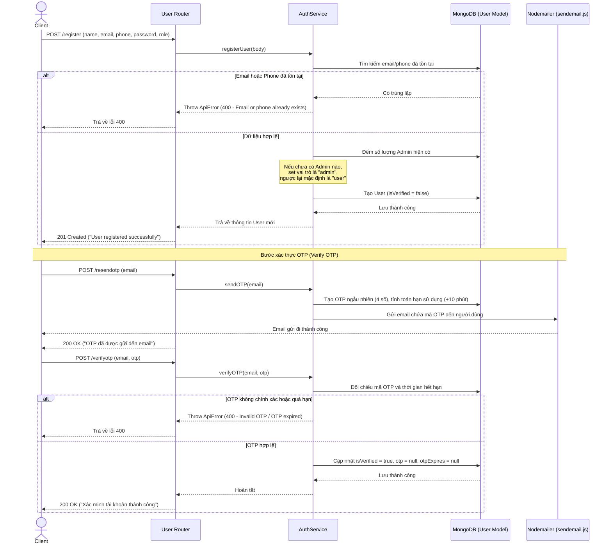
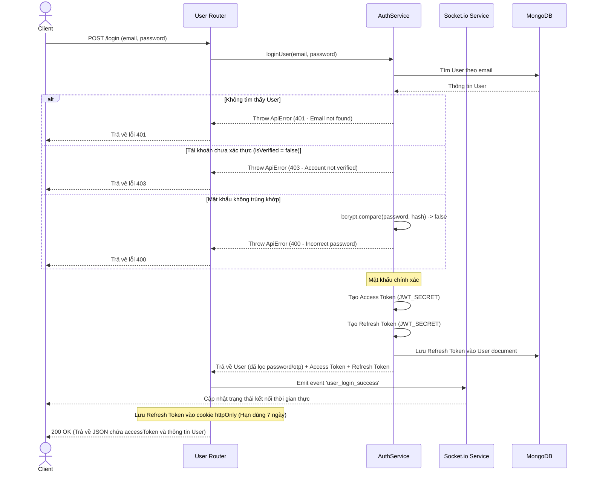

# Luồng API Xác Thực & Người Dùng (Authentication & User API)

Tất cả các API liên quan đến Xác thực và quản lý tài khoản người dùng được khai báo tại [api/routers/user.js](file:///c:/xampp/htdocs/Server_GreenHouse/api/routers/user.js) và xử lý bởi [api/controllers/usersController.js](file:///c:/xampp/htdocs/Server_GreenHouse/api/controllers/usersController.js) kết hợp với [api/services/authService.js](file:///c:/xampp/htdocs/Server_GreenHouse/api/services/authService.js) và [api/services/userService.js](file:///c:/xampp/htdocs/Server_GreenHouse/api/services/userService.js).

---

## 1. Danh Sách API Endpoints

| Phương thức | Endpoint | Middleware / Quyền | Validate Schema | Mô tả |
| :--- | :--- | :--- | :--- | :--- |
| **POST** | `/api/user/register` | Công khai | `auth.register` | Đăng ký tài khoản mới |
| **POST** | `/api/user/verifyotp` | Công khai | - | Xác minh mã OTP bằng email |
| **POST** | `/api/user/resendotp` | Công khai | - | Gửi lại mã OTP qua email |
| **POST** | `/api/user/login` | Công khai | `auth.login` | Đăng nhập hệ thống |
| **POST** | `/api/user/logout` | `verifyAccessToken` | `auth.logout` | Đăng xuất hệ thống |
| **POST** | `/api/user/refreshtoken` | `verifyAccessToken` | - | Tạo Access Token mới từ Refresh Token |
| **GET** | `/api/user/profile` | `verifyAccessToken` | - | Lấy thông tin tài khoản hiện hành |
| **GET** | `/api/user` | `verifyAccessToken` + `isAdminOrManager` | - | Lấy danh sách tài khoản (phân trang, lọc) |
| **GET** | `/api/user/:uid` | `verifyAccessToken` + `isAdminOrManager` | `user.getUser` | Lấy chi tiết thông tin người dùng |
| **PUT** | `/api/user/:uid` | `verifyAccessToken` + `isAdminOrManager` | `user.updateUser` | Cập nhật thông tin (có upload ảnh đại diện) |

---

## 2. Chi Tiết Luồng Hoạt Động (API Workflows)

### 2.1 Đăng Ký & Xác Thực Tài Khoản (Register & OTP Flow)



---

### 2.2 Đăng Nhập & Cấp Phát Token (Login Flow)

Khi người dùng thực hiện đăng nhập, hệ thống sẽ trả về **Access Token** (qua JSON) dùng để gửi kèm vào Header các request sau và **Refresh Token** (qua Cookie bảo mật `httpOnly`) dùng để tự động làm mới phiên làm việc. Đồng thời, Server sẽ kích hoạt sự kiện Socket.io báo hiệu đăng nhập thành công.



---

### 2.3 Cơ Chế Làm Mới Access Token (Refresh Token Flow)

Client không cần bắt người dùng đăng nhập lại khi Access Token hết hạn (ví dụ hết hạn sau 15-30 phút). Client chỉ cần gửi request không chứa thông tin đăng nhập trực tiếp, Server sẽ tự kiểm tra Cookie `refreshToken`.

- **Endpoint**: `POST /api/user/refreshtoken`
- **Luồng hoạt động**:
  1. Middleware `verifyAccessToken` trích xuất token cũ.
  2. Controller đọc `req.cookies.refreshToken`.
  3. Giải mã và kiểm tra chữ ký của `refreshToken`.
  4. Truy vấn database xem có User nào sở hữu `_id` từ token và trường `refreshToken` trong DB trùng khớp hay không.
  5. Nếu khớp, tạo một **Access Token mới** và phản hồi về Client dưới dạng JSON:
     ```json
     {
       "success": true,
       "newAccessToken": "eyJhbGciOi..."
     }
     ```

---

### 2.4 Đăng Xuất (Logout Flow)

- **Endpoint**: `POST /api/user/logout`
- **Luồng hoạt động**:
  1. Xác thực Access Token của người dùng đang gửi request.
  2. Tìm kiếm User theo `req.user._id` và cập nhật trường `refreshToken = null` trong cơ sở dữ liệu để vô hiệu hóa tất cả các phiên làm mới token trước đó.
  3. Xóa cookie `refreshToken` trên trình duyệt thông qua phương thức `res.clearCookie("refreshToken")`.
  4. Trả về thông báo thành công `200 OK` ("Đăng xuất thành công").
