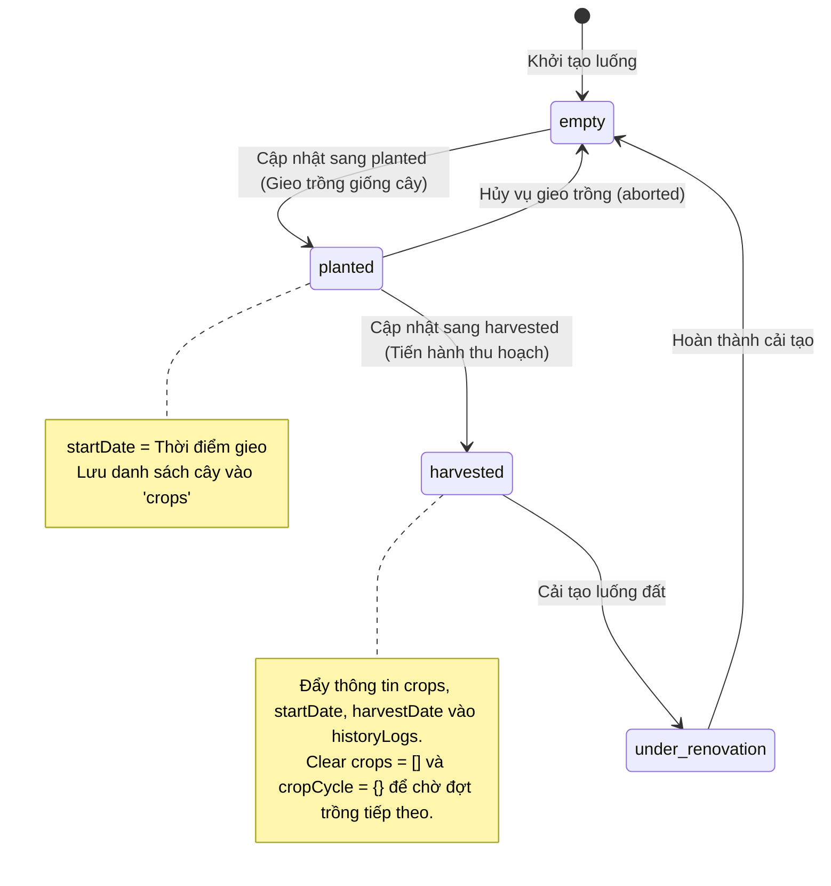

# Luồng API Luống Đất & Cây Trồng (Bed & Crop API)

Tài liệu này chi tiết hóa luồng hoạt động phức tạp của các API liên quan đến **Luống đất (Bed)** và **Cây trồng (Crop/Vegetable)**, bao gồm quản lý chu kỳ gieo trồng, cập nhật trạng thái thu hoạch, lưu nhật ký giám sát, và cơ chế phát thông tin Socket.io thời gian thực.

- **Bed Routing**: [api/routers/bed.js](file:///c:/xampp/htdocs/Server_GreenHouse/api/routers/bed.js) -> [api/controllers/bedController.js](file:///c:/xampp/htdocs/Server_GreenHouse/api/controllers/bedController.js)
- **Crop Routing**: [api/routers/crop.js](file:///c:/xampp/htdocs/Server_GreenHouse/api/routers/crop.js) -> [api/controllers/vegetableController.js](file:///c:/xampp/htdocs/Server_GreenHouse/api/controllers/vegetableController.js)

---

## 1. Danh Sách API Endpoints

### 1.1 API Luống Đất (Bed)
| Phương thức | Endpoint | Middleware / Quyền | Validate Schema | Mô tả |
| :--- | :--- | :--- | :--- | :--- |
| **POST** | `/api/bed` | Công khai | `bedvalidation.createBedSchema` | Tạo luống đất mới (kèm ảnh upload) |
| **PUT** | `/api/bed/:bedid` | Công khai | `bedvalidation.updateBedSchema` | Cập nhật thông tin cơ bản của luống |
| **PUT** | `/api/bed/statuslog/:bedid` | Công khai | `bedvalidation.updateBedStatusSchema` | Cập nhật chu kỳ trồng trọt / thu hoạch |
| **GET** | `/api/bed` | Công khai | - | Lấy danh sách các luống đất |
| **GET** | `/api/bed/:bedid` | Công khai | `bedvalidation.getBedByIdSchema` | Lấy chi tiết thông tin 1 luống đất |
| **DELETE** | `/api/bed` | Công khai | - | Xóa luống đất |
| **POST** | `/api/bed/log/:bedid` | `verifyAccessToken` | `bedvalidation.createlogSchema` | Thêm nhật ký giám sát (phát Socket) |
| **GET** | `/api/bed/log/:bedid` | `verifyAccessToken` | - | Lấy danh sách nhật ký giám sát của luống |
| **DELETE** | `/api/bed/:bedid/:logid` | `verifyAccessToken` | `bedvalidation.deletelogschema` | Xóa một nhật ký giám sát |
| **GET** | `/api/bed/historylog` | `verifyAccessToken` | - | Lấy nhật ký lịch sử gieo trồng / thu hoạch |
| **DELETE** | `/api/bed/history/:bedid/:historyid` | `verifyAccessToken` | - | Xóa một bản ghi lịch sử thu hoạch |

### 1.2 API Cây Trồng (Crop / Vegetable)
| Phương thức | Endpoint | Middleware / Quyền | Validate Schema | Mô tả |
| :--- | :--- | :--- | :--- | :--- |
| **POST** | `/api/crop` | Công khai | `vegetableValidation.createVegetableSchema` | Tạo loại cây trồng mới |
| **GET** | `/api/crop` | Công khai | - | Danh sách cây trồng (phân trang, lọc) |
| **GET** | `/api/crop/:cropid` | Công khai | `vegetableValidation.getVegetableByIdSchema` | Chi tiết cây trồng |
| **PUT** | `/api/crop/:cropid` | Công khai | - | Cập nhật thông tin cây trồng |
| **DELETE** | `/api/crop/:cropid` | Công khai | `vegetableValidation.deleteVegetableSchema` | Xóa cây trồng |

---

## 2. Chi Tiết Luồng Hoạt Động (API Workflows)

### 2.1 Luồng Gieo Trồng & Thu Hoạch (Bed Status Lifecycle)

Luống đất (`Bed`) có 4 trạng thái sinh trưởng tuần tự: `empty` (trống) $\rightarrow$ `planted` (đã gieo trồng) $\rightarrow$ `harvested` (đã thu hoạch) $\rightarrow$ `under_renovation` (đang cải tạo).



**Nguyên tắc nghiệp vụ xử lý tại `bedService.updateBedStatus`**:
- **Trồng mới (`planted`)**: Hệ thống kiểm tra nếu trạng thái hiện tại khác `empty` sẽ báo lỗi không cho gieo trồng.
- **Thu hoạch (`harvested`)**: Hệ thống tự động thiết lập ngày thu hoạch là thời gian hiện tại (`new Date()`). Lấy thông tin cây trồng cũ gộp với chu kỳ bắt đầu gieo trồng đẩy vào mảng `historyLogs` để lưu vết lịch sử. Sau đó, reset mảng `crops` về rỗng để luống sẵn sàng cho chu kỳ tiếp theo.

---

### 2.2 Nhật Ký Giám Sát Luống Đất & Truy Vấn Aggregation (Monitoring Logs & Aggregation)

Mỗi luống đất có một mảng nhật ký giám sát (`monitoringLogs`) tích hợp trực tiếp bên trong schema để lưu các thông số định kỳ.

#### A. Luồng thêm Nhật ký giám sát (Add Monitoring Log)
1. Request gửi tới `POST /api/bed/log/:bedid` với thông số `status` (`normal`, `warning`, `critical`) và `remarks`.
2. Hệ thống thực hiện `$push` log mới vào mảng `monitoringLogs` đồng thời cập nhật thời điểm kiểm tra cuối cùng `lastCheckedAt`.
3. Server lấy kết nối Socket.io phát tín hiệu tới phòng của luống đất đó để Client nhận dữ liệu tức thì:
   `io.to(bedid.toString()).emit('new_monitoring_log', bed)`

#### B. Cơ chế lấy danh sách Log bằng Aggregation Pipeline (`getMonitoringLogs`)
Do mảng `monitoringLogs` lồng ghép sâu trong `Bed` document, nên việc tìm kiếm phân trang đòi hỏi sử dụng **Aggregation Pipeline** của MongoDB:
- **Bước 1 (`$match`)**: Lọc ra luống đất có `_id` khớp với `bedid` truyền lên.
- **Bước 2 (`$unwind`)**: Trải phẳng mảng `monitoringLogs` thành các document riêng lẻ.
- **Bước 3 (`$match` bổ sung)**: Lọc tiếp theo các thuộc tính của log nếu Client truyền query (ví dụ: lọc theo `status`, hoặc tìm kiếm tương đối nội dung log).
- **Bước 4 (`$sort` / `$skip` / `$limit`)**: Sắp xếp nhật ký theo ngày kiểm tra và áp dụng phân trang.
- **Bước 5 (`$replaceRoot`)**: Biến đổi cấu trúc đầu ra để chỉ trả về thông tin của mảng log, loại bỏ các thông tin dư thừa của Bed:
  ```javascript
  pipeline.push({ $replaceRoot: { newRoot: "$monitoringLogs" } });
  ```
- **Bước 6 (Đếm tổng số)**: Chạy song song pipeline đếm (`$count`) để trả về `totalCount` phục vụ phân trang ở giao diện Client.
