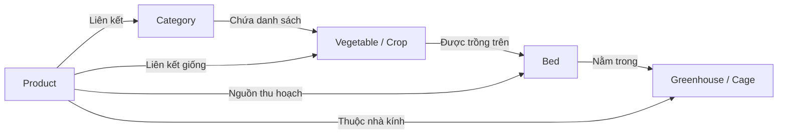

# Luồng API Thể Loại & Sản Phẩm (Category & Product API)

Tài liệu này chi tiết hóa cách thức hoạt động của các API liên quan đến **Thể loại (Category)** của cây trồng và **Sản phẩm (Product)** rau củ thương mại hóa đã thu hoạch để phục vụ phân phối, quản lý chuỗi cung ứng.

- **Category Routing**: [api/routers/category.js](file:///c:/xampp/htdocs/Server_GreenHouse/api/routers/category.js) -> [api/controllers/categoryController.js](file:///c:/xampp/htdocs/Server_GreenHouse/api/controllers/categoryController.js)
- **Product Routing**: [api/routers/product.js](file:///c:/xampp/htdocs/Server_GreenHouse/api/routers/product.js) -> [api/controllers/productController.js](file:///c:/xampp/htdocs/Server_GreenHouse/api/controllers/productController.js)

---

## 1. Danh Sách API Endpoints

### 1.1 API Thể Loại (Category)
| Phương thức | Endpoint | Middleware / Quyền | Validate Schema | Mô tả |
| :--- | :--- | :--- | :--- | :--- |
| **POST** | `/api/category` | Công khai | `categoryValidation.createCategorySchema` | Tạo một danh mục thể loại cây trồng mới |
| **GET** | `/api/category` | Công khai | - | Lấy danh sách thể loại (phân trang, lọc) |
| **GET** | `/api/category/:cid` | Công khai | `categoryValidation.createCategorySchema` | Chi tiết thể loại cây trồng |
| **PUT** | `/api/category/:cid` | Công khai | `categoryValidation.updateCategorySchema` | Cập nhật thể loại cây trồng |
| **DELETE** | `/api/category/:cid` | Công khai | `categoryValidation.deleteCategoryByIdSchema` | Xóa thể loại cây trồng |

### 1.2 API Sản Phẩm Thương Mại (Product)
| Phương thức | Endpoint | Middleware / Quyền | Validate Schema | Mô tả |
| :--- | :--- | :--- | :--- | :--- |
| **POST** | `/api/product` | `verifyAccessToken` + `isAdminOrManager` | `productvalidation.createProductSchema` | Tạo sản phẩm thương mại mới (kèm ảnh) |
| **PUT** | `/api/product/:pid` | `verifyAccessToken` + `isAdminOrManager` | `productvalidation.updateProductSchema` | Cập nhật thông tin sản phẩm (kèm ảnh) |
| **GET** | `/api/product/:pid` | Công khai | `productvalidation.updateProductSchema` | Lấy chi tiết thông tin 1 sản phẩm |
| **GET** | `/api/product` | Công khai | - | Lấy danh sách sản phẩm (phân trang, lọc) |
| **DELETE** | `/api/product/:pid` | `verifyAccessToken` + `isAdminOrManager` | `productvalidation.deleteProduct` | Xóa sản phẩm thương mại |

---

## 2. Chi Tiết Luồng Hoạt Động (API Workflows)

### 2.1 Mối Quan Hệ Giữa Thể Loại, Cây Trồng và Sản Phẩm (Relationship Workflow)

Sản phẩm (`Product`) là kết quả thu hoạch của một loại cây trồng (`Vegetable`) từ một hoặc nhiều luống đất (`Bed`) thuộc một nhà kính (`Greenhouse`).

**Các thuộc tính cốt lõi của một Sản phẩm (`Product`):**
- **Liên kết nguồn gốc**: Tham chiếu tới giống rau củ (`crops`), danh mục (`category`), nhà kính (`greenhouse`), và luống đất thu hoạch (`beds`).
- **Trạng thái chuỗi cung ứng (`status`)**:
  - `processing` (Đang xử lý sau thu hoạch)
  - `packaged` (Đã đóng gói)
  - `shipped` (Đang vận chuyển)
  - `delivered` (Đã giao hàng thành công)
- **Đơn vị bán lẻ (`unit`)**: Hỗ trợ định lượng theo `kg`, `bundle` (bó), hoặc `piece` (trái/củ).
- **Trạng thái chất lượng (`qualityStatus`)**: Phân loại theo thang đo `excellent`, `good`, `average`, `poor`.
- **Thông tin truy xuất nguồn gốc (`seedOrigin`)**: Xuất xứ hạt giống gieo trồng.

---

### 2.2 Nghiệp Vụ Tạo & Quản Lý Sản Phẩm (Product Management Logic)

- **Tạo sản phẩm (`createProduct`)**:
  1. Kiểm tra sự tồn tại của tên sản phẩm trong DB. Nếu trùng lặp, chặn lại và trả lỗi 400.
  2. Nếu Client gửi kèm file ảnh (`req.file`), middleware Cloudinary tự động tải ảnh lên và lưu đường dẫn ảnh vào thuộc tính `image`.
  3. Lưu toàn bộ liên kết nguồn gốc (Greenhouse, Beds, Crops) để phục vụ truy xuất nguồn gốc (Traceability) sau này.
- **Cập nhật sản phẩm (`updateProduct`)**:
  1. Cho phép thay đổi các thông tin chi tiết như trạng thái chuỗi cung ứng (ví dụ: chuyển từ `packaged` sang `shipped`), ghi chú (`notes`), cập nhật ảnh mới.
  2. Tự động cập nhật bản ghi trong MongoDB và trả về kết quả mới nhất cho Client.
- **Tìm kiếm & Bộ lọc nâng cao (`getProducts`)**:
  - Hỗ trợ phân trang mặc định (skip/limit).
  - Cho phép sắp xếp và giới hạn các trường hiển thị.
  - Tìm kiếm sản phẩm tương đối không phân biệt hoa thường bằng Regex qua tham số `?name=...`.
