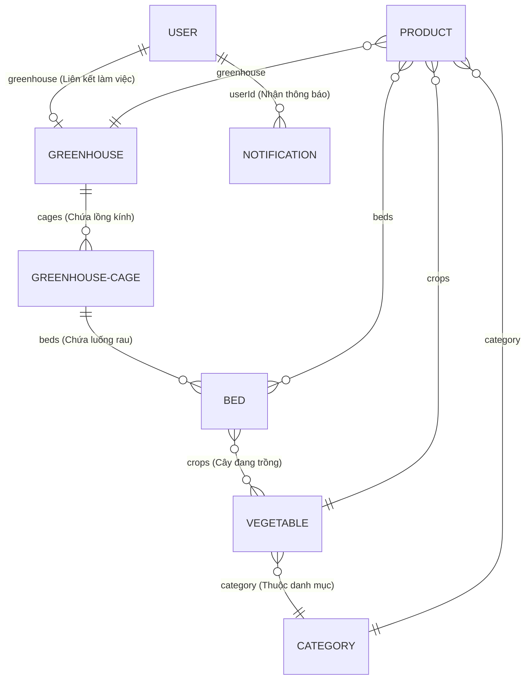

# Thiết Kế Cơ Sở Dữ Liệu & Mối Quan Hệ Giữa Các Bảng (Database Relationships)

Tài liệu này phân tích chi tiết thiết kế Cơ sở dữ liệu MongoDB của hệ thống **Greenhouse**, các schema Mongoose, các kiểu dữ liệu và mối quan hệ ràng buộc giữa các bảng dữ liệu.

---

## 1. Sơ Đồ Mối Quan Hệ Thực Thể (Entity-Relationship Diagram)

Sơ đồ ERD biểu diễn mối quan hệ tham chiếu giữa các thực thể chính trong hệ thống:

---

## 2. Chi Tiết Các Bảng Dữ Liệu (Mongoose Schemas)

### 2.1 Bảng Người Dùng (`User`)
Quản lý thông tin tài khoản, phân quyền truy cập và mã OTP xác minh.
* **Schema:** `api/models/userModel.js`
* **Các trường dữ liệu:**
  - `name` (String, Required): Tên hiển thị.
  - `image` (String): Link ảnh đại diện (Cloudinary).
  - `email` (String, Unique, Required): Email đăng nhập.
  - `phone` (String, Unique, Required): Số điện thoại liên hệ.
  - `password` (String, Required): Mật khẩu băm (bcryptjs).
  - `role` (String, Enum): Quyền hạn gồm `admin`, `manager`, `staff`, `user` (Mặc định `user`).
  - `isVerified` (Boolean): Trạng thái xác thực email qua OTP.
  - `otp` / `otpExpires`: Mã OTP xác minh và thời gian hết hạn (10 phút).
  - `greenhouse` (ObjectId $\rightarrow$ `Greenhouse`): Nhà kính mà nhân viên/quản lý này đang làm việc.

---

### 2.2 Bảng Nhà Kính (`Greenhouse`)
Quản lý các cơ sở nhà kính lớn của hệ thống.
* **Schema:** `api/models/greenhouseModel.js`
* **Các trường dữ liệu:**
  - `name` (String, Required, Unique): Tên nhà kính.
  - `image` (String): URL ảnh chụp nhà kính.
  - `operator` (Array of ObjectId $\rightarrow$ `User`): Danh sách nhân viên quản lý nhà kính này.
  - `cages` (Array of ObjectId $\rightarrow$ `GreenhouseCage`): Các lồng kính trực thuộc.
  - *Virtual Field* `numberOfCages`: Tự động tính số lượng lồng kính dựa trên mảng `cages`.

---

### 2.3 Bảng Lồng Kính (`GreenhouseCage`)
Các phân khu/lồng nhỏ nằm trong một nhà kính lớn.
* **Schema:** `api/models/greenhouseCageModel.js`
* **Các trường dữ liệu:**
  - `name` (String, Required): Tên lồng kính.
  - `image` (String): Hình ảnh lồng kính.
  - `greenhouse` (ObjectId $\rightarrow$ `Greenhouse`): Nhà kính chứa lồng này (Quan hệ N-1).
  - `beds` (Array of ObjectId $\rightarrow$ `Bed`): Danh sách luống rau nằm trong lồng kính này (Quan hệ 1-N).

---

### 2.4 Bảng Luống Đất (`Bed`)
Thực thể trung tâm theo dõi sát sao chu kỳ trồng rau và nhật ký nông nghiệp.
* **Schema:** `api/models/bedsModel.js`
* **Các trường dữ liệu:**
  - `name` (String, Required): Tên luống.
  - `image` (String): Ảnh chụp luống rau hiện tại.
  - `size` (Number): Kích thước diện tích luống.
  - `status` (String, Enum): Trạng thái gồm `empty`, `planted`, `harvested`, `under_renovation`.
  - `growthStatus` (String, Enum): Sức khỏe cây gồm `excellent`, `good`, `average`, `poor`.
  - `pestStatus` (String, Enum): Tình trạng sâu bệnh gồm `none`, `low`, `medium`, `high`.
  - `crops` (Array of ObjectId $\rightarrow$ `Vegetable`): Các giống cây đang gieo trồng trên luống này.
  - `cropCycle` (Object): Lưu `startDate` (ngày gieo) và `harvestDate` (ngày thu hoạch dự kiến/thực tế).
  - **`monitoringLogs` (Embedded Array):** Danh sách nhật ký kiểm tra sức khỏe gồm `checkDate`, `status` (`normal`, `warning`, `critical`), và `remarks` (ghi chú).
  - **`historyLogs` (Embedded Array):** Lịch sử các vụ gieo trồng cũ đã hoàn thành gồm giống rau, chu kỳ gieo-gặt, trạng thái thu hoạch (`harvested` hoặc `aborted`) và ghi chú.

---

### 2.5 Bảng Cây Trồng (`Vegetable`)
Từ điển các giống cây trồng hỗ trợ canh tác.
* **Schema:** `api/models/vegetablesModel.js`
* **Các trường dữ liệu:**
  - `name` (String, Required, Unique): Tên cây trồng (ví dụ: Xà lách, Cà chua).
  - `image` (String): Ảnh mẫu cây.
  - `harvestTime` (Number): Số ngày sinh trưởng cần thiết để thu hoạch.
  - `soilType` (String, Enum): Loại đất thích hợp gồm `Loamy`, `Clay`, `Sandy`, `Peaty`, `Saline`.
  - `description` (String): Mô tả và đặc tính giống cây.
  - `category` (ObjectId $\rightarrow$ `Category`): Thuộc thể loại rau quả nào.

---

### 2.6 Bảng Danh Mục (`Category`)
Phân loại các nhóm giống cây trồng.
* **Schema:** `api/models/categoryModel.js`
* **Các trường dữ liệu:**
  - `name` (String, Required, Unique): Tên danh mục (ví dụ: Rau ăn lá, Rau ăn củ).
  - `description` (String): Mô tả danh mục.
  - `vegetables` (Array of ObjectId $\rightarrow$ `Vegetable`): Danh sách các giống cây thuộc nhóm này.

---

### 2.7 Bảng Sản Phẩm (`Product`)
Các lô nông sản thu hoạch thương mại hóa đưa vào đóng gói và vận chuyển.
* **Schema:** `api/models/productModel.js`
* **Các trường dữ liệu:**
  - `name` (String, Required): Tên lô hàng sản phẩm.
  - `type` (String): Loại sản phẩm.
  - `crops` (ObjectId $\rightarrow$ `Vegetable`): Giống cây của sản phẩm này.
  - `category` (ObjectId $\rightarrow$ `Category`): Thể loại sản phẩm.
  - `greenhouse` (ObjectId $\rightarrow$ `Greenhouse`): Nhà kính thu hoạch.
  - `beds` (Array of ObjectId $\rightarrow$ `Bed`): Danh sách luống đất nguồn thu hoạch.
  - `totalQuantity` (Number): Tổng khối lượng sản phẩm.
  - `unit` (String, Enum): Đơn vị tính gồm `kg`, `bundle` (bó), `piece` (trái/củ).
  - `qualityStatus` (String, Enum): Phân loại chất lượng gồm `excellent`, `good`, `average`, `poor`.
  - `status` (String, Enum): Trạng thái chuỗi cung ứng gồm `processing`, `packaged`, `shipped`, `delivered`.
  - `seedOrigin` (String): Nguồn gốc hạt giống gieo trồng ban đầu.
  - `notes` (String): Ghi chú đóng gói.

---

### 2.8 Bảng Thông Báo (`Notification`)
Điều hành công việc và gửi cảnh báo thời gian thực.
* **Schema:** `api/models/notificationmodel.js`
* **Các trường dữ liệu:**
  - `userId` (ObjectId $\rightarrow$ `User`): Nhân viên nhận thông báo/nhiệm vụ.
  - `greenhouseId` (ObjectId $\rightarrow$ `Greenhouse`): Địa điểm nhà kính xảy ra sự việc.
  - `cageId` (ObjectId $\rightarrow$ `GreenhouseCage`): Vị trí lồng kính cụ thể.
  - `bedId` (ObjectId $\rightarrow$ `Bed`): Vị trí luống rau cần xử lý.
  - `taskType` (String, Enum): Loại tác vụ gồm `Tưới nước`, `Bón phân`, `Phun thuốc`, `Kiểm tra nhiệt độ`, `Thu hoạch`.
  - `message` (String): Chi tiết nội dung công việc.
  - `isRead` (Boolean): Trạng thái đã đọc của nhân viên (Mặc định `false`).

---

## 3. Các Loại Quan Hệ Thiết Kế Trong MongoDB

### 3.1 Quan Hệ Tham Chiếu Hai Chiều (Bidirectional References)
Để tối ưu hóa tốc độ truy vấn, hệ thống sử dụng tham chiếu hai chiều giữa các mô hình cha-con:
* **Greenhouse và GreenhouseCage:**
  - `Greenhouse` chứa mảng `cages` lưu danh sách ID các lồng kính.
  - `GreenhouseCage` chứa thuộc tính `greenhouse` trỏ ngược lại ID của Greenhouse chứa nó.
* **GreenhouseCage và Bed:**
  - `GreenhouseCage` chứa mảng `beds` lưu ID các luống.
  - Khi lấy thông tin chi tiết của một Greenhouse, việc sử dụng `.populate('cages')` giúp trả về toàn bộ dữ liệu phân cấp mà không cần thực hiện nhiều câu lệnh truy vấn phức tạp.

### 3.2 Nhúng Dữ Liệu (Embedding) vs Tham Chiếu (Referencing)
* **Nhúng dữ liệu (Embedded Arrays):**
  - Mảng `monitoringLogs` và `historyLogs` được nhúng trực tiếp vào trong `Bed` document.
  - **Lý do:** Nhật ký kiểm tra và lịch sử thu hoạch gắn liền hoàn toàn với vòng đời của luống đất đó, không cần dùng lại ở các bảng khác. Việc nhúng giúp việc truy cập nhật ký nhanh hơn (chỉ cần 1 câu lệnh đọc Bed) và đảm bảo tính toàn vẹn (Atomic updates) trên một Document duy nhất.
* **Tham chiếu (Referencing):**
  - Các liên kết như `crops` trong `Bed`, `category` trong `Vegetable` sử dụng ObjectId tham chiếu.
  - **Lý do:** Tránh lặp đi lặp lại thông tin giống cây (ví dụ mô tả cây trồng, thời gian thu hoạch) trên từng luống đất, giúp tiết kiệm bộ nhớ và khi sửa thông tin một giống cây, tất cả các luống sẽ tự động nhận thông tin cập nhật mới nhất.
