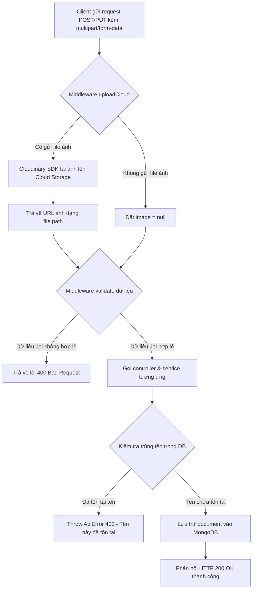

# Luồng API Quản Lý Nhà Kính & Lồng Kính (Greenhouse & Cage API)

Tài liệu này chi tiết hóa luồng hoạt động của các API quản lý thực thể **Nhà kính (Greenhouse)** và **Lồng kính (GreenhouseCage)** nằm trong hệ thống giám sát nông nghiệp.

- **Greenhouse Routing**: [api/routers/greenhouse.js](file:///c:/xampp/htdocs/Server_GreenHouse/api/routers/greenhouse.js) -> [api/controllers/greenhouseController.js](file:///c:/xampp/htdocs/Server_GreenHouse/api/controllers/greenhouseController.js)
- **GreenhouseCage Routing**: [api/routers/greenhousecage.js](file:///c:/xampp/htdocs/Server_GreenHouse/api/routers/greenhousecage.js) -> [api/controllers/greenhouseCageController.js](file:///c:/xampp/htdocs/Server_GreenHouse/api/controllers/greenhouseCageController.js)

---

## 1. Danh Sách API Endpoints

### 1.1 API Nhà Kính (Greenhouse)
| Phương thức | Endpoint | Middleware / Quyền | Validate Schema | Mô tả |
| :--- | :--- | :--- | :--- | :--- |
| **POST** | `/api/greenhouse` | `verifyAccessToken` + `isAdminOrManager` | `greenhouseValidation.updateGreenhouseSchema` | Tạo mới một nhà kính (kèm ảnh upload) |
| **PUT** | `/api/greenhouse/:grid` | `verifyAccessToken` + `isAdminOrManager` | `greenhouseValidation.updateGreenhouseSchema` | Cập nhật thông tin nhà kính theo ID |
| **GET** | `/api/greenhouse` | Công khai | - | Lấy danh sách các nhà kính (có lọc, phân trang) |
| **GET** | `/api/greenhouse/:grid` | Công khai | `greenhouseValidation.getGreenhouseByIdSchema` | Lấy chi tiết một nhà kính theo ID (populate lồng kính) |
| **DELETE** | `/api/greenhouse/:grid` | `verifyAccessToken` + `isAdminOrManager` | `greenhouseValidation.deleteGreenhouseSchema` | Xóa nhà kính theo ID |

### 1.2 API Lồng Nhà Kính (GreenhouseCage)
| Phương thức | Endpoint | Middleware / Quyền | Validate Schema | Mô tả |
| :--- | :--- | :--- | :--- | :--- |
| **POST** | `/api/greenhousecage` | Công khai (Chưa chặn) | `greenhousecageValidation.createGreenhouseCageSchema` | Tạo mới một lồng kính |
| **PUT** | `/api/greenhousecage/:cageid` | Công khai (Chưa chặn) | `greenhousecageValidation.updateGreenhouseCageSchema` | Cập nhật lồng kính theo ID |
| **GET** | `/api/greenhousecage` | Công khai | - | Lấy danh sách lồng kính |
| **GET** | `/api/greenhousecage/:cageid` | Công khai | `greenhousecageValidation.getGreenhouseCageByIdSchema` | Lấy chi tiết một lồng kính |
| **DELETE** | `/api/greenhousecage/:cageid` | Công khai (Chưa chặn) | `greenhousecageValidation.deleteGreenhouseCageSchema` | Xóa lồng kính theo ID |

---

## 2. Chi Tiết Luồng Hoạt Động (API Workflows)

### 2.1 Luồng Tạo & Cập Nhật Nhà Kính / Lồng Kính (Tải ảnh lên Cloudinary)

Khi tạo mới hoặc cập nhật một nhà kính hoặc lồng kính, hệ thống cho phép tải lên một file ảnh minh họa. Luồng xử lý như sau:

### 2.2 Cơ Chế Tìm Kiếm, Sắp Xếp và Phân Trang (Query Feature)

Hệ thống cung cấp cơ chế truy vấn danh sách rất mạnh mẽ ở tầng Service (`greenhouseService.getGreenhouses` và `greenhousecageService.getGreenhousecages`). Client có thể gửi kèm các tham số trên query string:

1. **Loại bỏ các trường cấu hình khỏi bộ lọc**:
   Các tham số `limit`, `sort`, `page`, `fields` được tách riêng để phục vụ hiển thị, các tham số còn lại được coi là bộ lọc điều kiện MongoDB.
2. **Hỗ trợ toán tử so sánh (`gt`, `lt`, `eq`, `gte`, `lte`)**:
   Hệ thống chuyển đổi tự động các chuỗi so sánh sang dạng điều kiện MongoDB (ví dụ: `?temperature[gt]=25` chuyển thành `{ temperature: { $gt: 25 } }`).
3. **Tìm kiếm theo tên không phân biệt chữ hoa thường (Case-insensitive Regex)**:
   Nếu truyền `?name=Kính A`, hệ thống sẽ dịch thành `{ name: { $regex: /Kính A/i } }`.
4. **Phân trang (Pagination)**:
   - Cách tính số phần tử bỏ qua: `skip = (page - 1) * limit`.
   - `limit` mặc định lấy từ biến môi trường `LIMIT_GREENHOUSECAGES` hoặc bằng `10`.
5. **Chọn trường dữ liệu trả về (`fields`)**:
   Client có thể chỉ định lấy một số trường cần thiết, ngăn chặn quá tải băng thông (Ví dụ: `?fields=name,image`).
6. **Sắp xếp (`sort`)**:
   Sắp xếp tăng/giảm dần theo các trường mong muốn (Ví dụ: `?sort=-createdAt` để xếp mới nhất lên đầu).
7. **Populate dữ liệu quan hệ**:
   Khi lấy thông tin nhà kính, API tự động liên kết (populate) toàn bộ danh sách các lồng kính trực thuộc (`cages`).
