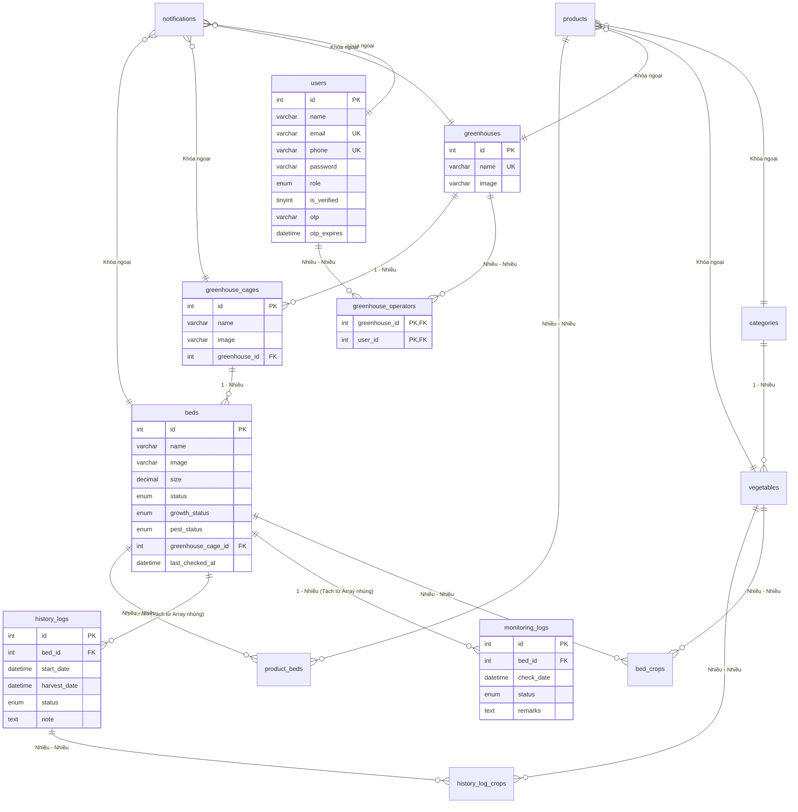

# Hướng Dẫn Chuyển Đổi & Thiết Kế Cơ Sở Dữ Liệu MySQL (MySQL Migration Guide)

Tài liệu này hướng dẫn cách chuyển đổi cơ sở dữ liệu của dự án từ cấu trúc **MongoDB (NoSQL Document)** sang **MySQL (RDBMS Relational)**. Tài liệu bao gồm phân tích các thay đổi về mặt kiến trúc, chi tiết thiết kế các bảng trung gian (junction tables), sơ đồ thực thể mối quan hệ SQL (ERD) và mã SQL DDL mẫu để tạo bảng.

---

## 1. Sự Khác Biệt Triết Lý Thiết Kế (MongoDB vs MySQL)

| Đặc tính | MongoDB (Dự án hiện tại) | MySQL (Chuyển đổi đề xuất) |
| :--- | :--- | :--- |
| **Mảng lồng nhau (Embedded Arrays)** | Lưu trữ trực tiếp dạng mảng `[ObjectId]` hoặc đối tượng lồng nhau (ví dụ: `monitoringLogs` nằm trong `Bed`). | Không hỗ trợ lưu mảng. Phải tách các mảng này thành các **bảng độc lập** có quan hệ khóa ngoại (Foreign Key). |
| **Quan hệ Nhiều - Nhiều (M-N)** | Lưu mảng các ID trực tiếp trong Document cha (ví dụ: `operator: [User]` trong Greenhouse). | Bắt buộc phải sử dụng **Bảng trung gian (Junction Table / Bridge Table)** để liên kết khóa ngoại từ hai bảng. |
| **Định dạng dữ liệu** | Schema động (Dynamic), hỗ trợ BSON/JSON. | Schema cố định (Strict). Cần định nghĩa rõ kiểu dữ liệu (`INT`, `VARCHAR`, `DATETIME`, `DECIMAL`, `ENUM`). |
| **Tính toàn vẹn dữ liệu** | Hỗ trợ ACID ở cấp độ Document đơn lẻ. Phải tự xử lý kiểm tra khóa ngoại bằng code ứng dụng. | Hỗ trợ ACID toàn hệ thống thông qua cơ chế khóa ngoại (`FOREIGN KEY`) ràng buộc tự động (`ON DELETE CASCADE`, `ON UPDATE CASCADE`). |

---

## 2. Sơ Đồ Thực Thể Mối Quan Hệ SQL (Mermaid SQL ERD)

Dưới đây là sơ đồ biểu diễn các bảng trong MySQL và các mối liên kết khóa ngoại. Các bảng màu vàng/có hậu tố `_junction` hoặc `_operators` đại diện cho các bảng trung gian giải quyết quan hệ Nhiều - Nhiều.



---

## 3. Thiết Kế Các Bảng Trung Gian (Junction Tables)

Trong MySQL, để thể hiện quan hệ Nhiều - Nhiều (Many-to-Many), ta phải tạo một bảng trung gian chứa các cặp khóa ngoại trỏ tới hai bảng chính.

### 3.1 Bảng `greenhouse_operators`
Giải quyết quan hệ: **Một nhà kính có thể được vận hành bởi nhiều nhân viên, và một nhân viên có thể vận hành nhiều nhà kính.**
- **Khóa chính (Composite Primary Key):** Sự kết hợp của `(greenhouse_id, user_id)`.
- **Ràng buộc:** Nếu xóa một Nhà kính hoặc một User, dòng liên kết tương ứng trong bảng này sẽ tự động bị xóa (`ON DELETE CASCADE`).

### 3.2 Bảng `bed_crops`
Giải quyết quan hệ: **Một luống đất (`Bed`) có thể trồng nhiều loại rau cùng lúc (Intercropping), và một giống rau (`Vegetable`) có thể được trồng trên nhiều luống khác nhau.**
- **Khóa chính:** `(bed_id, vegetable_id)`.

### 3.3 Bảng `product_beds`
Giải quyết quan hệ: **Một lô sản phẩm thu hoạch đóng gói (`Product`) có thể được gom từ nhiều luống đất (`Bed`) khác nhau.**
- **Khóa chính:** `(product_id, bed_id)`.

### 3.4 Bảng `history_log_crops`
Giải quyết quan hệ: **Một bản ghi lịch sử thu hoạch (`history_logs`) lưu giữ thông tin của nhiều loại cây trồng đã gặt hái.**
- **Khóa chính:** `(history_log_id, vegetable_id)`.

### 3.5 Giải pháp Kiểm soát đồng thời cho Luống Đất (Optimistic Concurrency Control - OCC)
Để giải quyết bài toán tranh chấp đồng thời khi **2 tài khoản cùng lúc cập nhật 1 luống rau**, hệ thống áp dụng phương pháp **Kiểm soát đồng thời lạc quan (OCC)** thông qua cột `version` trong bảng `beds`.
- Mỗi lần đọc dữ liệu, Client nhận kèm số `version` hiện tại.
- Khi cập nhật dữ liệu, câu lệnh SQL sẽ là:
  ```sql
  UPDATE beds 
  SET status = 'planted', version = version + 1 
  WHERE id = ? AND version = ?;
  ```
- Nếu số hàng bị ảnh hưởng (`affected rows`) trả về là `0`, hệ thống phát hiện ra phiên bản đã bị thay đổi bởi tài khoản khác trước đó, lập tức báo lỗi và yêu cầu người dùng reload trang để tránh ghi đè chéo mất dữ liệu.


---

## 4. Mã SQL DDL Tạo Bảng Chi Tiết (MySQL DDL Script)

Dưới đây là mã SQL chuẩn để khởi tạo hệ thống cơ sở dữ liệu trên MySQL:

```sql
-- 1. Bảng danh mục giống cây
CREATE TABLE categories (
    id INT AUTO_INCREMENT PRIMARY KEY,
    name VARCHAR(100) NOT NULL UNIQUE,
    description TEXT,
    created_at TIMESTAMP DEFAULT CURRENT_TIMESTAMP,
    updated_at TIMESTAMP DEFAULT CURRENT_TIMESTAMP ON UPDATE CURRENT_TIMESTAMP
) ENGINE=InnoDB DEFAULT CHARSET=utf8mb4;

-- 2. Bảng giống cây (Vegetables / Crops)
CREATE TABLE vegetables (
    id INT AUTO_INCREMENT PRIMARY KEY,
    name VARCHAR(100) NOT NULL UNIQUE,
    image VARCHAR(255) DEFAULT NULL,
    harvest_time INT COMMENT 'Thời gian thu hoạch (số ngày)',
    soil_type ENUM('Loamy', 'Clay', 'Sandy', 'Peaty', 'Saline') DEFAULT 'Loamy',
    description TEXT,
    category_id INT,
    created_at TIMESTAMP DEFAULT CURRENT_TIMESTAMP,
    updated_at TIMESTAMP DEFAULT CURRENT_TIMESTAMP ON UPDATE CURRENT_TIMESTAMP,
    FOREIGN KEY (category_id) REFERENCES categories(id) ON DELETE SET NULL
) ENGINE=InnoDB DEFAULT CHARSET=utf8mb4;

-- 3. Bảng Người dùng (Users)
CREATE TABLE users (
    id INT AUTO_INCREMENT PRIMARY KEY,
    name VARCHAR(100) NOT NULL,
    image VARCHAR(255) DEFAULT NULL,
    email VARCHAR(100) NOT NULL UNIQUE,
    phone VARCHAR(20) NOT NULL UNIQUE,
    password VARCHAR(255) NOT NULL,
    role ENUM('user', 'admin', 'manager', 'staff') DEFAULT 'user',
    is_verified TINYINT(1) DEFAULT 0,
    otp VARCHAR(10) DEFAULT NULL,
    otp_expires DATETIME DEFAULT NULL,
    created_at TIMESTAMP DEFAULT CURRENT_TIMESTAMP,
    updated_at TIMESTAMP DEFAULT CURRENT_TIMESTAMP ON UPDATE CURRENT_TIMESTAMP
) ENGINE=InnoDB DEFAULT CHARSET=utf8mb4;

-- 4. Bảng Nhà kính (Greenhouses)
CREATE TABLE greenhouses (
    id INT AUTO_INCREMENT PRIMARY KEY,
    name VARCHAR(100) NOT NULL UNIQUE,
    image VARCHAR(255) DEFAULT NULL,
    created_at TIMESTAMP DEFAULT CURRENT_TIMESTAMP,
    updated_at TIMESTAMP DEFAULT CURRENT_TIMESTAMP ON UPDATE CURRENT_TIMESTAMP
) ENGINE=InnoDB DEFAULT CHARSET=utf8mb4;

-- 5. BẢNG TRUNG GIAN: Phân công vận hành nhà kính (Greenhouse Operators)
CREATE TABLE greenhouse_operators (
    greenhouse_id INT,
    user_id INT,
    PRIMARY KEY (greenhouse_id, user_id),
    FOREIGN KEY (greenhouse_id) REFERENCES greenhouses(id) ON DELETE CASCADE,
    FOREIGN KEY (user_id) REFERENCES users(id) ON DELETE CASCADE
) ENGINE=InnoDB DEFAULT CHARSET=utf8mb4;

-- 6. Bảng Lồng kính (Greenhouse Cages)
CREATE TABLE greenhouse_cages (
    id INT AUTO_INCREMENT PRIMARY KEY,
    name VARCHAR(100) NOT NULL,
    image VARCHAR(255) DEFAULT NULL,
    greenhouse_id INT NOT NULL,
    created_at TIMESTAMP DEFAULT CURRENT_TIMESTAMP,
    updated_at TIMESTAMP DEFAULT CURRENT_TIMESTAMP ON UPDATE CURRENT_TIMESTAMP,
    FOREIGN KEY (greenhouse_id) REFERENCES greenhouses(id) ON DELETE CASCADE
) ENGINE=InnoDB DEFAULT CHARSET=utf8mb4;

-- 7. Bảng Luống đất (Beds)
CREATE TABLE beds (
    id INT AUTO_INCREMENT PRIMARY KEY,
    name VARCHAR(100) NOT NULL,
    image VARCHAR(255) DEFAULT NULL,
    size DECIMAL(10,2) COMMENT 'Diện tích luống đất (m2)',
    status ENUM('empty', 'planted', 'harvested', 'under_renovation') DEFAULT 'empty',
    growth_status ENUM('excellent', 'good', 'average', 'poor') DEFAULT 'good',
    pest_status ENUM('none', 'low', 'medium', 'high') DEFAULT 'none',
    greenhouse_cage_id INT NOT NULL,
    last_checked_at DATETIME DEFAULT CURRENT_TIMESTAMP,
    version INT DEFAULT 1 NOT NULL COMMENT 'Phiên bản để kiểm soát đồng thời lạc quan (OCC)',
    created_at TIMESTAMP DEFAULT CURRENT_TIMESTAMP,
    updated_at TIMESTAMP DEFAULT CURRENT_TIMESTAMP ON UPDATE CURRENT_TIMESTAMP,
    FOREIGN KEY (greenhouse_cage_id) REFERENCES greenhouse_cages(id) ON DELETE CASCADE
) ENGINE=InnoDB DEFAULT CHARSET=utf8mb4;


-- 8. BẢNG TRUNG GIAN: Cây đang trồng trên luống (Bed Crops)
CREATE TABLE bed_crops (
    bed_id INT,
    vegetable_id INT,
    PRIMARY KEY (bed_id, vegetable_id),
    FOREIGN KEY (bed_id) REFERENCES beds(id) ON DELETE CASCADE,
    FOREIGN KEY (vegetable_id) REFERENCES vegetables(id) ON DELETE CASCADE
) ENGINE=InnoDB DEFAULT CHARSET=utf8mb4;

-- 9. TÁCH TỪ ARRAY NHÚNG: Nhật ký giám sát luống (Monitoring Logs)
CREATE TABLE monitoring_logs (
    id INT AUTO_INCREMENT PRIMARY KEY,
    bed_id INT NOT NULL,
    check_date DATETIME DEFAULT CURRENT_TIMESTAMP,
    status ENUM('normal', 'warning', 'critical') DEFAULT 'normal',
    remarks TEXT,
    created_at TIMESTAMP DEFAULT CURRENT_TIMESTAMP,
    FOREIGN KEY (bed_id) REFERENCES beds(id) ON DELETE CASCADE
) ENGINE=InnoDB DEFAULT CHARSET=utf8mb4;

-- 10. TÁCH TỪ ARRAY NHÚNG: Lịch sử gieo trồng/thu hoạch (History Logs)
CREATE TABLE history_logs (
    id INT AUTO_INCREMENT PRIMARY KEY,
    bed_id INT NOT NULL,
    start_date DATETIME NOT NULL,
    harvest_date DATETIME NOT NULL,
    status ENUM('harvested', 'aborted') DEFAULT 'harvested',
    note TEXT,
    created_at TIMESTAMP DEFAULT CURRENT_TIMESTAMP,
    FOREIGN KEY (bed_id) REFERENCES beds(id) ON DELETE CASCADE
) ENGINE=InnoDB DEFAULT CHARSET=utf8mb4;

-- 11. BẢNG TRUNG GIAN: Cây trồng trong lịch sử thu hoạch (History Log Crops)
CREATE TABLE history_log_crops (
    history_log_id INT,
    vegetable_id INT,
    PRIMARY KEY (history_log_id, vegetable_id),
    FOREIGN KEY (history_log_id) REFERENCES history_logs(id) ON DELETE CASCADE,
    FOREIGN KEY (vegetable_id) REFERENCES vegetables(id) ON DELETE CASCADE
) ENGINE=InnoDB DEFAULT CHARSET=utf8mb4;

-- 12. Bảng Sản phẩm thương mại (Products)
CREATE TABLE products (
    id INT AUTO_INCREMENT PRIMARY KEY,
    name VARCHAR(150) NOT NULL,
    type VARCHAR(50) DEFAULT NULL,
    vegetable_id INT,
    category_id INT,
    greenhouse_id INT,
    total_quantity DECIMAL(12,2) COMMENT 'Khối lượng thu hoạch thực tế',
    unit ENUM('kg', 'bundle', 'piece') DEFAULT 'kg',
    harvest_date DATETIME DEFAULT CURRENT_TIMESTAMP,
    quality_status ENUM('excellent', 'good', 'average', 'poor') DEFAULT 'good',
    status ENUM('processing', 'packaged', 'shipped', 'delivered') DEFAULT 'processing',
    seed_origin VARCHAR(150) DEFAULT NULL,
    notes TEXT,
    image VARCHAR(255) DEFAULT NULL,
    created_at TIMESTAMP DEFAULT CURRENT_TIMESTAMP,
    updated_at TIMESTAMP DEFAULT CURRENT_TIMESTAMP ON UPDATE CURRENT_TIMESTAMP,
    FOREIGN KEY (vegetable_id) REFERENCES vegetables(id) ON DELETE SET NULL,
    FOREIGN KEY (category_id) REFERENCES categories(id) ON DELETE SET NULL,
    FOREIGN KEY (greenhouse_id) REFERENCES greenhouses(id) ON DELETE SET NULL
) ENGINE=InnoDB DEFAULT CHARSET=utf8mb4;

-- 13. BẢNG TRUNG GIAN: Liên kết luống thu hoạch của sản phẩm (Product Beds)
CREATE TABLE product_beds (
    product_id INT,
    bed_id INT,
    PRIMARY KEY (product_id, bed_id),
    FOREIGN KEY (product_id) REFERENCES products(id) ON DELETE CASCADE,
    FOREIGN KEY (bed_id) REFERENCES beds(id) ON DELETE CASCADE
) ENGINE=InnoDB DEFAULT CHARSET=utf8mb4;

-- 14. Bảng thông báo nhiệm vụ (Notifications)
CREATE TABLE notifications (
    id INT AUTO_INCREMENT PRIMARY KEY,
    user_id INT NOT NULL,
    greenhouse_id INT,
    cage_id INT,
    bed_id INT,
    task_type ENUM('Tưới nước', 'Bón phân', 'Phun thuốc', 'Kiểm tra nhiệt độ', 'Thu hoạch') NOT NULL,
    message TEXT NOT NULL,
    is_read TINYINT(1) DEFAULT 0,
    created_at TIMESTAMP DEFAULT CURRENT_TIMESTAMP,
    updated_at TIMESTAMP DEFAULT CURRENT_TIMESTAMP ON UPDATE CURRENT_TIMESTAMP,
    FOREIGN KEY (user_id) REFERENCES users(id) ON DELETE CASCADE,
    FOREIGN KEY (greenhouse_id) REFERENCES greenhouses(id) ON DELETE SET NULL,
    FOREIGN KEY (cage_id) REFERENCES greenhouse_cages(id) ON DELETE SET NULL,
    FOREIGN KEY (bed_id) REFERENCES beds(id) ON DELETE SET NULL
) ENGINE=InnoDB DEFAULT CHARSET=utf8mb4;
```
