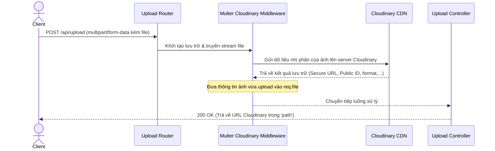
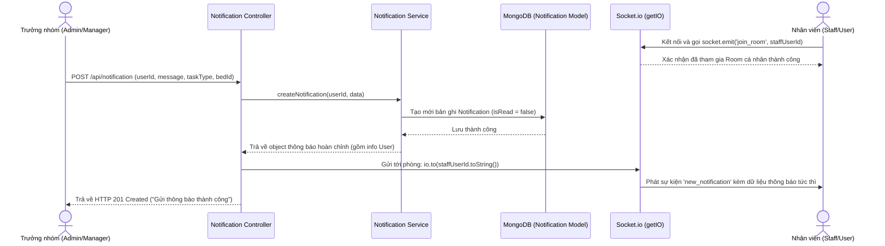

# Luồng API Hình Ảnh & Thông Báo (Upload & Notification API)

Tài liệu này chi tiết hóa cách thức hoạt động của **API Upload hình ảnh lên Cloudinary** và **API Quản lý thông báo công việc (Notification)** kết hợp Socket.io gửi dữ liệu thời gian thực.

- **Upload Routing**: [api/routers/uploadimage.js](file:///c:/xampp/htdocs/Server_GreenHouse/api/routers/uploadimage.js) -> [api/controllers/uploadimage.js](file:///c:/xampp/htdocs/Server_GreenHouse/api/controllers/uploadimage.js)
- **Notification Routing**: [api/routers/notification.js](file:///c:/xampp/htdocs/Server_GreenHouse/api/routers/notification.js) -> [api/controllers/notificationController.js](file:///c:/xampp/htdocs/Server_GreenHouse/api/controllers/notificationController.js)

---

## 1. Danh Sách API Endpoints

### 1.1 API Upload Hình Ảnh
| Phương thức | Endpoint | Middleware / Quyền | Phản hồi JSON | Mô tả |
| :--- | :--- | :--- | :--- | :--- |
| **POST** | `/api/upload` | Công khai (Tùy biến upload đơn lẻ) | `{ success, path, filename }` | Tải một file ảnh lên Cloudinary |

### 1.2 API Thông Báo Công Việc (Notification)
| Phương thức | Endpoint | Middleware / Quyền | Validate Schema | Mô tả |
| :--- | :--- | :--- | :--- | :--- |
| **POST** | `/api/notification` | `verifyAccessToken` | `notificationvalidation.createNotification` | Tạo thông báo công việc mới |
| **GET** | `/api/notification` | Công khai | - | Lấy danh sách toàn bộ thông báo |
| **PUT** | `/api/notification/:noId` | `verifyAccessToken` | `notificationvalidation.updateNotification` | Cập nhật thông báo |
| **DELETE** | `/api/notification/:noId` | `verifyAccessToken` | - | Xóa một thông báo |

---

## 2. Chi Tiết Luồng Hoạt Động (API Workflows)

### 2.1 Luồng Tải Hình Ảnh Lên Cloudinary (Image Upload Flow)

Dự án sử dụng thư viện `multer-storage-cloudinary` tích hợp trực tiếp để tự động hóa khâu lưu trữ ảnh trực tuyến mà không tốn dung lượng ổ đĩa của server.

---

### 2.2 Luồng Gửi & Nhận Thông Báo Thời Gian Thực (Notification Real-time Flow)

Hệ thống hỗ trợ gửi thông báo phân công tác vụ (Tưới nước, Bón phân, Phun thuốc, Kiểm tra nhiệt độ, Thu hoạch) đến trực tiếp tài khoản nhân viên phụ trách nhà kính.

- **Khi cập nhật thông báo (`PUT /api/notification/:noId`)**: Cập nhật thông số công việc của thông báo trong DB. Sau đó phát ra sự kiện Socket.io:
  `io.to(userId.toString()).emit('notification_updated', { notificationId: noId });`
- **Khi xóa thông báo (`DELETE /api/notification/:noId`)**: Xóa bản ghi trong DB. Đồng thời phát ra sự kiện Socket.io:
  `io.to(userId.toString()).emit('notification_deleted', { noId });`
- Sự kiện Socket.io đảm bảo cho ứng dụng Client của nhân viên lập tức biến mất hoặc cập nhật trạng thái thông báo mà không cần reload trang web.
