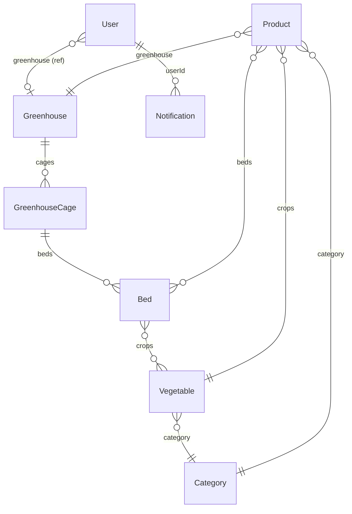

# Tổng Quan Hệ Thống GreenHouse Backend

Dự án **Backend_GreenHouse** là một hệ thống RESTful API được xây dựng trên nền tảng **Node.js** và **Express.js**, kết hợp cơ sở dữ liệu **MongoDB** qua thư viện **Mongoose**. Dự án được thiết kế để quản lý các nhà kính (Greenhouse), lồng nhà kính (Greenhouse Cage), luống đất (Bed), cây trồng (Crop/Vegetable), danh mục sản phẩm (Category/Product) và cung cấp hệ thống cảnh báo, giám sát thời gian thực bằng **Socket.io**.

---

## 1. Công Nghệ Sử Dụng

- **Core Framework**: Node.js & Express.js (v4.21.2)
- **Database**: MongoDB & Mongoose (v7.4.2)
- **Real-time Communication**: Socket.io (v4.8.1)
- **Authentication**: JSON Web Token (JWT) & bcryptjs
- **Media Storage**: Cloudinary (lưu trữ hình ảnh của nhà kính, luống rau, sản phẩm)
- **Email Service**: Nodemailer (dùng để gửi OTP xác thực tài khoản)
- **Validation**: Joi (kiểm thực dữ liệu đầu vào của các request)

---

## 2. Cấu Trúc Thư Mục Dự Án

Dự án áp dụng mô hình kiến trúc **MVC (Model-View-Controller)** kết hợp tầng **Service (Service Layer)** để tách biệt phần logic nghiệp vụ và phần xử lý request/response:

```text
Server_GreenHouse/
├── api/
│   ├── config/          # Cấu hình DB, Socket.io, Cloudinary
│   ├── controllers/     # Điều hướng request, xử lý HTTP response
│   ├── middlewares/     # Middleware xác thực JWT, phân quyền, validate dữ liệu, xử lý lỗi
│   ├── models/          # Khai báo schema Mongoose cho cơ sở dữ liệu
│   ├── routers/         # Định nghĩa các endpoint (tuyến đường API)
│   ├── services/        # Tầng logic nghiệp vụ (business logic) tương tác với DB
│   ├── validators/      # Định nghĩa các schema Joi để validate dữ liệu request
│   ├── untiles/         # Các hàm tiện ích (ApiError, gửi mail OTP, pick fields)
│   └── index.js         # Điểm khởi chạy ứng dụng (Entry point)
├── docs/                # Thư mục chứa tài liệu hướng dẫn vận hành API
├── package.json         # Danh sách thư viện phụ thuộc và scripts khởi chạy
└── truffle-config.js    # Cấu hình Truffle (dành cho blockchain trong tương lai)
```

---

## 3. Kiến Trúc Cơ Sở Dữ Liệu (Mongoose Schemas)

Mối quan hệ giữa các thực thể chính trong hệ thống:



- **User**: Quản lý tài khoản (Admin, Manager, Staff, User). Chứa thông tin đăng ký, mật khẩu băm, trạng thái xác thực và OTP.
- **Greenhouse**: Nhà kính lớn. Chứa danh sách các lồng kính (`cages`) và quản lý viên (`operator`).
- **GreenhouseCage**: Lồng kính nằm trong nhà kính. Liên kết với một nhà kính cụ thể và chứa danh sách các luống đất (`beds`).
- **Bed**: Luống đất trồng trọt. Lưu thông tin cây đang trồng, chu kỳ sinh trưởng, nhật ký theo dõi (`monitoringLogs`) và lịch sử thu hoạch (`historyLogs`).
- **Vegetable**: Định nghĩa loại cây trồng (thời gian thu hoạch, loại đất, thể loại).
- **Category**: Danh mục phân loại các giống cây trồng.
- **Product**: Sản phẩm rau quả thu hoạch thương mại hóa (nguồn gốc hạt giống, trạng thái đóng gói, chất lượng, thông tin truy xuất từ nhà kính/luống đất).
- **Notification**: Thông báo công việc (Tưới nước, Bón phân, Phun thuốc, Cảnh báo nhiệt độ, Thu hoạch) gửi đến người dùng.

---

## 4. Cơ Chế Real-time (Socket.io Rooms & Events)

Socket.io được sử dụng để truyền tải dữ liệu tức thời mà không cần Client phải reload hay gửi request liên tục (Polling).

### Các Room chính:
- **Room theo User ID (`userId`)**: Mỗi người dùng kết nối sẽ tự động tham gia vào phòng có tên là `userId` của họ để nhận thông báo cá nhân.
- **Room theo Bed ID (`bedid`)**: Client (ví dụ ứng dụng giám sát luống rau) có thể tham gia vào room của từng luống rau để cập nhật trực tiếp trạng thái sức khỏe, độ ẩm, nhiệt độ.

### Danh sách các Event Socket phát ra từ Server:
| Event Name | Phòng nhận | Mô tả | Dữ liệu kèm theo |
| :--- | :--- | :--- | :--- |
| `user_login_success` | Broadcast toàn hệ thống | Phát ra khi người dùng đăng nhập thành công | Thông tin User & Token |
| `new_monitoring_log` | Bed ID Room | Có một nhật ký giám sát mới được thêm vào luống | Dữ liệu log và Bed cập nhật |
| `log_deleted` | Bed ID Room | Xóa một nhật ký giám sát cũ | `{ bedId, logId }` |
| `history_log_deleted` | Bed ID Room | Xóa một lịch sử thu hoạch | `{ bedid, historyid }` |
| `new_notification` | User ID Room | Có thông báo công việc/cảnh báo mới cho user | Chi tiết thông báo |
| `notification_updated` | User ID Room | Cập nhật trạng thái thông báo (ví dụ: đã đọc) | `{ notificationId }` |
| `notification_deleted` | User ID Room | Xóa bỏ thông báo khỏi danh sách | `{ noId }` |

---

## 5. Danh Sách Các Tài Liệu Chi Tiết API

Hệ thống API được phân rã thành các luồng nghiệp vụ chi tiết sau:

1. [Luồng API Xác Thực & Người Dùng](file:///c:/xampp/htdocs/Server_GreenHouse/docs/auth_user_api.md)
2. [Luồng API Quản Lý Nhà Kính & Lồng Kính](file:///c:/xampp/htdocs/Server_GreenHouse/docs/greenhouse_cage_api.md)
3. [Luồng API Luống Đất & Cây Trồng](file:///c:/xampp/htdocs/Server_GreenHouse/docs/bed_crop_api.md)
4. [Luồng API Thể Loại](file:///c:/xampp/htdocs/Server_GreenHouse/docs/category_product_api.md)
5. [Luồng API Hình Ảnh & Thông Báo](file:///c:/xampp/htdocs/Server_GreenHouse/docs/notification_upload_api.md)
6. [Luồng API Sản Phẩm Thương Mại](file:///c:/xampp/htdocs/Server_GreenHouse/docs/product.md)
7. [Hướng Dẫn Chuyển Đổi & Thiết Kế MySQL](file:///c:/xampp/htdocs/Server_GreenHouse/docs/mysql_migration.md)
8. [Quy Trình Quản Lý & Kiểm Thử API Chuẩn](file:///c:/xampp/htdocs/Server_GreenHouse/docs/workflow_api_testing.md)


