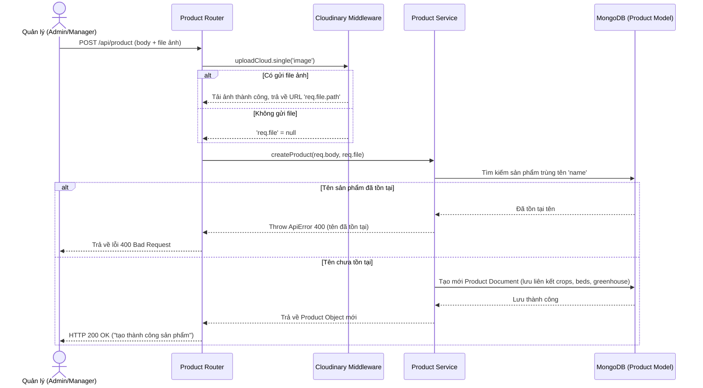
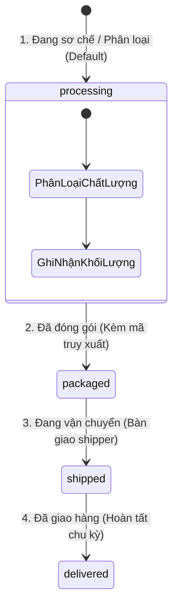

# Luồng API Quản Lý Sản Phẩm Thương Mại (Product API)

Tài liệu này chi tiết hóa toàn bộ luồng hoạt động, cấu trúc cơ sở dữ liệu và các API liên quan đến quản lý **Sản phẩm thương mại (Product)** – nông sản sau khi được thu hoạch từ các luống đất thuộc hệ thống nhà kính.

- **Product Routing:** [api/routers/product.js](file:///c:/xampp/htdocs/Server_GreenHouse/api/routers/product.js)
- **Product Controller:** [api/controllers/productController.js](file:///c:/xampp/htdocs/Server_GreenHouse/api/controllers/productController.js)
- **Product Service:** [api/services/productService.js](file:///c:/xampp/htdocs/Server_GreenHouse/api/services/productService.js)
- **Product Model:** [api/models/productModel.js](file:///c:/xampp/htdocs/Server_GreenHouse/api/models/productModel.js)

---

## 1. Danh Sách API Endpoints

Mọi API thay đổi dữ liệu sản phẩm (Thêm, Sửa, Xóa) đều yêu cầu quyền hạn cao (`admin` hoặc `manager`) để bảo mật chuỗi cung ứng.

| Phương thức | Endpoint | Middleware / Quyền | Validate Schema | Mô tả |
| :--- | :--- | :--- | :--- | :--- |
| **POST** | `/api/product` | `verifyAccessToken` + `isAdminOrManager` | `productvalidation.createProductSchema` | Tạo lô sản phẩm mới (kèm ảnh upload) |
| **PUT** | `/api/product/:pid` | `verifyAccessToken` + `isAdminOrManager` | `productvalidation.updateProductSchema` | Cập nhật thông tin/trạng thái sản phẩm |
| **GET** | `/api/product/:pid` | Công khai | `productvalidation.updateProductSchema` | Lấy chi tiết thông tin 1 sản phẩm |
| **GET** | `/api/product` | Công khai | - | Lấy danh sách sản phẩm (có lọc, phân trang) |
| **DELETE** | `/api/product/:pid` | `verifyAccessToken` + `isAdminOrManager` | `productvalidation.deleteProduct` | Xóa vĩnh viễn sản phẩm |

---

## 2. Cấu Trúc Schema Sản Phẩm (`Product Model`)

Sản phẩm được lưu trữ trong MongoDB với các trường thông tin để phục vụ **Truy xuất nguồn gốc (Traceability)** và **Theo dõi chuỗi cung ứng (Supply Chain Tracking)**:

```javascript
{
  name: String,            // Tên sản phẩm / Tên lô hàng (Bắt buộc)
  type: String,            // Loại sản phẩm
  crops: ObjectId,         // Giống cây trồng gieo hạt (Ref: Vegetable)
  category: ObjectId,      // Danh mục nhóm rau củ (Ref: Category)
  greenhouse: ObjectId,    // Nhà kính thu hoạch (Ref: Greenhouse)
  beds: [ObjectId],        // Các luống đất cụ thể đã thu hoạch (Ref: Bed)
  totalQuantity: Number,   // Tổng khối lượng thu hoạch
  unit: String,            // Đơn vị tính: 'kg', 'bundle' (bó), 'piece' (trái/củ)
  harvestDate: Date,       // Ngày thu hoạch (Mặc định: Now)
  qualityStatus: String,   // Chất lượng: 'excellent', 'good', 'average', 'poor'
  seedOrigin: String,      // Nguồn gốc hạt giống gieo trồng
  status: String,          // Trạng thái chuỗi cung ứng: 'processing', 'packaged', 'shipped', 'delivered'
  notes: String,           // Ghi chú đóng gói / giao nhận
  image: String            // Đường dẫn hình ảnh thực tế lưu trên Cloudinary
}
```

---

## 3. Chi Tiết Luồng Nghiệp Vụ Cốt Lõi

### 3.1 Luồng Tạo Sản Phẩm & Tải Ảnh Lên Cloudinary

Khi một lô rau củ được thu hoạch, người quản lý tiến hành khai báo sản phẩm thương mại mới:



---

### 3.2 Luồng Cập Nhật Trạng Thái Chuỗi Cung Ứng (Supply Chain Lifecycle)

Sản phẩm di chuyển qua 4 trạng thái chính được kiểm soát chặt chẽ nhằm đảm bảo tính chính xác:



* **API Cập Nhật:** `PUT /api/product/:pid`
* **Cách thức hoạt động:** Người quản lý gửi request thay đổi trường `status` (ví dụ từ `packaged` sang `shipped` khi xuất kho). API sẽ ghi nhận thay đổi và cập nhật tức thời dữ liệu trên hệ thống.

---

### 3.3 Truy Xuất Nguồn Gốc Sản Phẩm (Traceability Query Flow)

Khi người mua hoặc đối tác quét mã sản phẩm hoặc tìm kiếm thông tin, API chi tiết sản phẩm sẽ trả về dữ liệu liên kết nguồn gốc nông nghiệp:

1. **Client gửi yêu cầu:** `GET /api/product/:pid`
2. **Server thực hiện Populate:** 
   Để người xem biết sản phẩm trồng ở đâu, hạt giống nào, Server tự động liên kết các ID trong DB thành đối tượng chi tiết:
   - `crops`: Xem chi tiết giống cây, thời gian sinh trưởng đặc trưng.
   - `greenhouse`: Biết được nhà kính nào đã sản xuất.
   - `beds`: Truy xuất nhật ký chăm sóc (`monitoringLogs`) của luống đất đã tạo ra sản phẩm này để kiểm chứng độ an toàn thực phẩm.
3. **Phản hồi:** Trả về JSON chứa đầy đủ phả hệ nông sản của sản phẩm đó.
