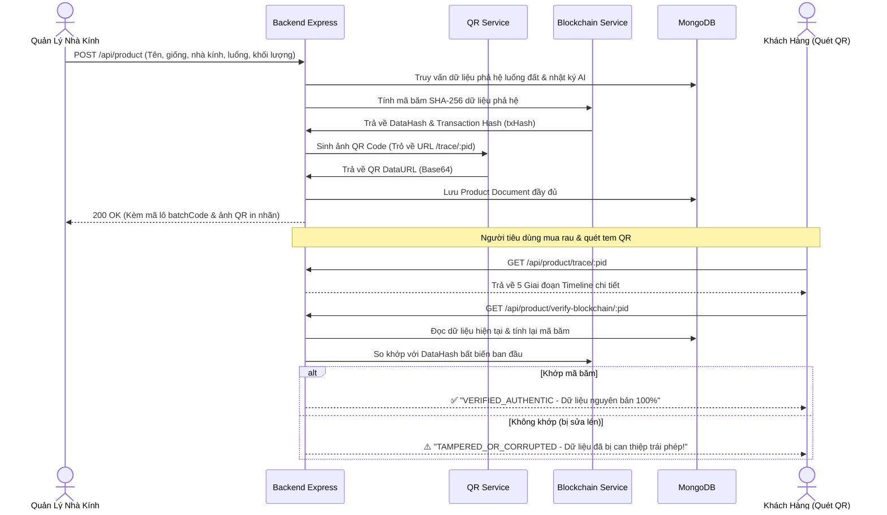

# Luồng API Truy Xuất Nguồn Gốc Nông Sản, QR Code & Chứng Thực Blockchain

Tài liệu này chi tiết hóa toàn bộ luồng hoạt động, cấu trúc cơ sở dữ liệu, hợp đồng thông minh Solidity và các API liên quan đến **Truy xuất nguồn gốc nông sản (Agricultural Traceability)**, **Tự động sinh mã tem QR** và **Chứng thực tính bất biến chống gian lận trên Blockchain**.

- **Product Router:** [api/routers/product.js](file:///c:/xampp/htdocs/Server_GreenHouse/api/routers/product.js)
- **Product Controller:** [api/controllers/productController.js](file:///c:/xampp/htdocs/Server_GreenHouse/api/controllers/productController.js)
- **Product Service:** [api/services/productService.js](file:///c:/xampp/htdocs/Server_GreenHouse/api/services/productService.js)
- **Blockchain Service:** [api/services/blockchainService.js](file:///c:/xampp/htdocs/Server_GreenHouse/api/services/blockchainService.js)
- **QR Code Service:** [api/services/qrCodeService.js](file:///c:/xampp/htdocs/Server_GreenHouse/api/services/qrCodeService.js)
- **Smart Contract:** [contracts/GreenhouseSupplyChain.sol](file:///c:/xampp/htdocs/Server_GreenHouse/contracts/GreenhouseSupplyChain.sol)

---

## 1. Danh Sách API Endpoints

| Phương thức | Endpoint | Quyền hạn | Mục đích sử dụng |
| :--- | :--- | :--- | :--- |
| **POST** | `/api/product` | `Admin` / `Manager` | Tạo lô hàng mới. Tự động sinh `batchCode`, tạo ảnh tem `qrCode`, băm dữ liệu và ghi lên `Blockchain`. |
| **GET** | `/api/product/trace/:pid` | **Public** (Không cần đăng nhập) | **API chính cho người quét mã QR**: Trả về trọn vẹn 5 giai đoạn của chu kỳ nông sản từ hạt giống đến bàn ăn. |
| **GET** | `/api/product/verify-blockchain/:pid` | **Public** | **Kiểm chứng chống gian lận**: Tự động băm lại dữ liệu hiện tại trong DB và đối chiếu với mã băm ban đầu trên Blockchain. |
| **GET** | `/api/product/:pid` | **Public** | Lấy chi tiết thông tin cơ bản của sản phẩm. |
| **GET** | `/api/product` | **Public** | Danh sách sản phẩm (hỗ trợ phân trang, tìm kiếm theo tên, mã lô `batchCode`). |
| **PUT** | `/api/product/:pid` | `Admin` / `Manager` | Cập nhật thông tin/trạng thái chuỗi cung ứng (`packaged`, `shipped`, `delivered`). |
| **DELETE** | `/api/product/:pid` | `Admin` / `Manager` | Xóa sản phẩm. |

---

## 2. Luồng Nghiệp Vụ Cốt Lõi (Architecture Workflow)



---

## 3. Chi Tiết Các API Mới

### 3.1 API Tạo Lô Hàng Tự Động Sinh QR & Blockchain
* **Endpoint:** `POST /api/product`
* **Headers:** `Authorization: Bearer <accessToken>`
* **Content-Type:** `multipart/form-data` hoặc `application/json`
* **Body:**
  ```json
  {
    "name": "Xà Lách Thủy Canh VietGAP - Lô 01",
    "type": "Rau ăn lá thủy canh",
    "crops": "60d5ec49f1b2c8b1f8e4e1a1",
    "category": "60d5ec49f1b2c8b1f8e4e1a2",
    "greenhouse": "60d5ec49f1b2c8b1f8e4e1a3",
    "beds": ["60d5ec49f1b2c8b1f8e4e1a4"],
    "totalQuantity": 150,
    "unit": "kg",
    "qualityStatus": "excellent",
    "seedOrigin": "Nhập khẩu F1 Hà Lan - Rijk Zwaan",
    "status": "packaged",
    "notes": "Đóng gói màng sinh học tự hủy"
  }
  ```
* **Phản hồi thành công (HTTP 200):**
  ```json
  {
    "success": true,
    "message": "tạo thành công sản phẩm",
    "product": {
      "_id": "6aba2b9507174da5c61d3aaa",
      "name": "Xà Lách Thủy Canh VietGAP - Lô 01",
      "batchCode": "BATCH-20260928-XALA-8F3A",
      "qrCode": "data:image/png;base64,iVBORw0KGgoAAAANSUhEUgAAAUAAAAFA...",
      "blockchain": {
        "dataHash": "0x4532ca0857bf26dbca3065abf2bc2c52596523d0aefed283a430ef97a26974fb",
        "txHash": "0x02f6a7d73a79c3059e2d00b9c76e69da6eb8b528644e674b07f26eb069a9b59a",
        "network": "Sepolia Testnet / Provenance Ledger",
        "blockNumber": 19823412,
        "isVerified": true
      },
      "totalQuantity": 150,
      "unit": "kg",
      "status": "packaged"
    }
  }
  ```

---

### 3.2 API Truy Xuất Nguồn Gốc (GET /api/product/trace/:pid)
Dành riêng cho giao diện quét mã QR trên điện thoại, trả về **5 Giai Đoạn Vòng Đời**:

* **Endpoint:** `GET /api/product/trace/6aba2b9507174da5c61d3aaa`
* **Quyền:** Public
* **Phản hồi mẫu:**
  ```json
  {
    "success": true,
    "message": "Truy xuất nguồn gốc nông sản thành công",
    "data": {
      "productId": "6aba2b9507174da5c61d3aaa",
      "productName": "Xà Lách Thủy Canh VietGAP - Lô 01",
      "batchCode": "BATCH-20260928-XALA-8F3A",
      "qrCode": "data:image/png;base64,...",
      "currentStatus": "packaged",
      "qualityStatus": "excellent",
      "timeline": [
        {
          "stage": 1,
          "code": "SEEDING_AND_GENETICS",
          "title": "1. Nguồn Gốc Hạt Giống & Gieo Trồng",
          "status": "COMPLETED",
          "details": {
            "cropName": "Xà Lách Romaine F1",
            "category": "Rau ăn lá thủy canh",
            "seedOrigin": "Nhập khẩu F1 Hà Lan - Rijk Zwaan",
            "expectedHarvestDays": 45,
            "soilOrSubstrateType": "Giá thể xơ dừa hữu cơ vi sinh"
          }
        },
        {
          "stage": 2,
          "code": "CULTIVATION_AND_AI_INSPECTION",
          "title": "2. Chăm Sóc & Kiểm Định AI Bác Sĩ Cây Trồng",
          "status": "COMPLETED",
          "details": {
            "greenhouseName": "Nhà Kính Khu A - Công Nghệ Cao",
            "location": "Khu Nông Nghiệp Công Nghệ Cao",
            "bedsCount": 1,
            "totalInspections": 6,
            "aiHealthInspectionCount": 2,
            "purityCertification": "100% Không Dư Lượng Thuốc Bảo Vệ Thực Vật Độc Hại",
            "recentLogs": [
              {
                "bedName": "Luống Rau 01",
                "status": "normal",
                "remarks": "[AI Bác Sĩ Cây Trồng] Cây Trồng Khỏe Mạnh & An Toàn. Lá căng đều tự nhiên, rễ trắng khỏe.",
                "loggedAt": "2026-09-25T08:30:00.000Z"
              }
            ]
          }
        },
        {
          "stage": 3,
          "code": "HARVESTING_AND_GRADING",
          "title": "3. Thu Hoạch & Đánh Giá Phân Loại",
          "status": "COMPLETED",
          "details": {
            "harvestDate": "2026-09-28T07:15:00.000Z",
            "totalQuantity": 150,
            "unit": "kg",
            "qualityGrade": "Hạng Nhất (Chuẩn Xuất Khẩu)"
          }
        },
        {
          "stage": 4,
          "code": "PACKAGING_AND_TRACE_QR",
          "title": "4. Đóng Gói & Cấp Mã Tem QR",
          "status": "COMPLETED",
          "details": {
            "batchCode": "BATCH-20260928-XALA-8F3A",
            "packageStatus": "packaged",
            "expiryRecommendation": "3 - 5 ngày ở nhiệt độ 5 - 10°C"
          }
        },
        {
          "stage": 5,
          "code": "BLOCKCHAIN_AUTHENTICATION",
          "title": "5. Chứng Thực Toàn Vẹn Blockchain",
          "status": "VERIFIED",
          "details": {
            "isImmutable": true,
            "blockchainNetwork": "Sepolia Testnet / Cryptographic Ledger",
            "transactionHash": "0x02f6a7d73a79c3059e2d00b9c76e69da6eb8b528644e674b07f26eb069a9b59a",
            "dataHash": "0x4532ca0857bf26dbca3065abf2bc2c52596523d0aefed283a430ef97a26974fb",
            "verificationStatus": "ĐÃ XÁC THỰC BẤT BIẾN",
            "tamperProofGuarantee": "Dữ liệu được bảo vệ bằng mật mã học SHA-256 & Smart Contract, không thể bị sửa đổi trái phép."
          }
        }
      ]
    }
  }
  ```

---

### 3.3 API Xác Thực Tính Toàn Vẹn Blockchain (GET /api/product/verify-blockchain/:pid)
* **Endpoint:** `GET /api/product/verify-blockchain/6aba2b9507174da5c61d3aaa`
* **Quyền:** Public

* **Trường hợp 1: Dữ liệu nguyên bản (Thành công)**
  ```json
  {
    "success": true,
    "message": "✅ Dữ liệu nguồn gốc hoàn toàn nguyên bản, trùng khớp 100% với mã băm bất biến trên Blockchain.",
    "data": {
      "productId": "6aba2b9507174da5c61d3aaa",
      "batchCode": "BATCH-20260928-XALA-8F3A",
      "onChainHash": "0x4532ca0857bf26dbca3065abf2bc2c52596523d0aefed283a430ef97a26974fb",
      "currentComputedHash": "0x4532ca0857bf26dbca3065abf2bc2c52596523d0aefed283a430ef97a26974fb",
      "isValid": true,
      "status": "VERIFIED_AUTHENTIC"
    }
  }
  ```

* **Trường hợp 2: Dữ liệu bị ai đó sửa lén trong Database (Cảnh báo gian lận)**
  ```json
  {
    "success": true,
    "message": "⚠️ CẢNH BÁO: Dữ liệu hiện tại KHÔNG khớp với mã băm ban đầu trên Blockchain! Có dấu hiệu bị chỉnh sửa trái phép.",
    "data": {
      "productId": "6aba2b9507174da5c61d3aaa",
      "isValid": false,
      "status": "TAMPERED_OR_CORRUPTED"
    }
  }
  ```

---

## 4. Code Mẫu Giao Diện React Quét QR & Hiển Thị Timeline

Dưới đây là Component React mẫu dành cho trang công khai `src/pages/TraceProductPage.jsx`:

```jsx
import React, { useEffect, useState } from 'react';
import { useParams } from 'react-router-dom';
import axios from 'axios';

export default function TraceProductPage() {
  const { productId } = useParams();
  const [traceData, setTraceData] = useState(null);
  const [verifyStatus, setVerifyStatus] = useState(null);
  const [loading, setLoading] = useState(true);

  useEffect(() => {
    // 1. Gọi API lấy dòng thời gian nông sản
    axios.get(`http://localhost:8088/api/product/trace/${productId}`)
      .then(res => setTraceData(res.data.data))
      .catch(err => console.error(err))
      .finally(() => setLoading(false));
  }, [productId]);

  const handleVerifyBlockchain = async () => {
    try {
      const res = await axios.get(`http://localhost:8088/api/product/verify-blockchain/${productId}`);
      setVerifyStatus(res.data.data);
    } catch (err) {
      alert('Lỗi xác thực blockchain');
    }
  };

  if (loading) return <div style={{ textAlign: 'center', padding: 50 }}>Đang tải hành trình nông sản... 🌱</div>;
  if (!traceData) return <div style={{ textAlign: 'center', padding: 50 }}>Không tìm thấy thông tin lô hàng này! ❌</div>;

  return (
    <div style={{ maxWidth: 650, margin: '20px auto', fontFamily: 'Arial, sans-serif', padding: 15 }}>
      {/* Header Lô Nông Sản */}
      <div style={{ textAlign: 'center', borderBottom: '2px solid #2e7d32', paddingBottom: 15 }}>
        <h2 style={{ color: '#1b5e20', marginBottom: 5 }}>🌿 {traceData.productName}</h2>
        <span style={{ background: '#e8f5e9', color: '#2e7d32', padding: '4px 12px', borderRadius: 15, fontWeight: 'bold' }}>
          Mã Lô: {traceData.batchCode}
        </span>
        {traceData.qrCode && (
          <div style={{ marginTop: 15 }}>
            
            <p style={{ fontSize: 12, color: '#666' }}>Tem truy xuất nguồn gốc chính hãng</p>
          </div>
        )}
      </div>

      {/* Nút bấm kiểm chứng Blockchain */}
      <div style={{ textAlign: 'center', margin: '20px 0' }}>
        <button 
          onClick={handleVerifyBlockchain}
          style={{ background: '#0288d1', color: '#fff', border: 'none', padding: '10px 20px', borderRadius: 8, cursor: 'pointer', fontWeight: 'bold' }}>
          ⛓️ Kiểm Tra Tính Toàn Vẹn Blockchain
        </button>

        {verifyStatus && (
          <div style={{ marginTop: 10, padding: 10, borderRadius: 8, background: verifyStatus.isValid ? '#e8f5e9' : '#ffebee' }}>
            <strong style={{ color: verifyStatus.isValid ? '#2e7d32' : '#c62828' }}>
              {verifyStatus.message}
            </strong>
          </div>
        )}
      </div>

      {/* Dòng thời gian 5 Giai Đoạn (Timeline) */}
      <h3 style={{ color: '#333' }}>📋 Hành Trình Nông Sản Từ Nông Trại:</h3>
      <div style={{ borderLeft: '3px solid #4caf50', marginLeft: 15, paddingLeft: 20 }}>
        {traceData.timeline.map((step) => (
          <div key={step.stage} style={{ marginBottom: 25, position: 'relative' }}>
            <span style={{ position: 'absolute', left: -29, top: 0, background: '#4caf50', color: '#fff', borderRadius: '50%', width: 20, height: 20, textAlign: 'center', fontSize: 12, lineHeight: '20px' }}>
              {step.stage}
            </span>
            <h4 style={{ margin: '0 0 5px 0', color: '#1b5e20' }}>{step.title}</h4>
            <div style={{ background: '#f9f9f9', padding: 12, borderRadius: 8, fontSize: 14, color: '#444' }}>
              <pre style={{ whiteSpace: 'pre-wrap', fontFamily: 'inherit', margin: 0 }}>
                {JSON.stringify(step.details, null, 2)}
              </pre>
            </div>
          </div>
        ))}
      </div>
    </div>
  );
}
```
