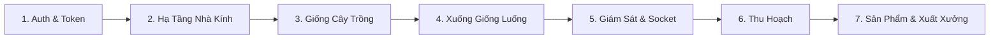

# Quy Trình Quản Lý & Hướng Dẫn Kiểm Thử API Chuẩn (API Testing & Management Workflow)

Tài liệu này cung cấp **Quy trình chuẩn hóa toàn bộ vòng đời dự án** kết hợp **Kịch bản kiểm thử API (Test Flow)** theo thứ tự từ A - Z. Bạn có thể sử dụng tài liệu này để kiểm thử nhanh chóng và chính xác trên Postman, Thunder Client hoặc cURL.

---

## 1. Thiết Lập Môi Trường Kiểm Thử (Environment Setup)

Trước khi thực hiện kiểm thử, cấu hình các biến môi trường (Environment Variables) trong công cụ test (Postman / Thunder Client):

| Tên biến | Giá trị mẫu | Mô tả |
| :--- | :--- | :--- |
| `baseUrl` | `http://localhost:8080/api` | Địa chỉ máy chủ API |
| `accessToken` | *(Tự động gán sau khi login)* | Chuỗi JWT Token xác thực |
| `greenhouseId` | *(Gán sau khi tạo Nhà kính)* | ID của Nhà kính đang test |
| `cageId` | *(Gán sau khi tạo Lồng kính)* | ID của Lồng kính đang test |
| `bedId` | *(Gán sau khi tạo Luống)* | ID của Luống đất đang test |
| `cropId` | *(Gán sau khi tạo Cây)* | ID của Giống cây đang test |
| `productId` | *(Gán sau khi tạo Sản phẩm)* | ID Lô sản phẩm thương mại |

### Header Mặc Định Cho Mọi Request (Trừ Upload ảnh):
```http
Content-Type: application/json
Authorization: Bearer {{accessToken}}
```

---

## 2. Quy Trình Kiểm Thử Chuẩn Tuần Tự (7 Giai Đoạn)



---

### GIAI ĐOẠN 1: Xác Thực & Cấp Quyền (Authentication)

#### 1.1 Đăng ký tài khoản Admin đầu tiên
* **Phương thức:** `POST {{baseUrl}}/user/register`
* **Quyền:** Public
* **Body:**
  ```json
  {
    "name": "Super Admin",
    "email": "admin@greenhouse.com",
    "phone": "0988123456",
    "password": "Password123@",
    "role": "admin"
  }
  ```
* **Kỳ vọng:** HTTP `201 Created` (`success: true`).

#### 1.2 Gửi lại mã OTP & Xác thực tài khoản
* **Gửi OTP:** `POST {{baseUrl}}/user/resendotp`
  * Body: `{ "email": "admin@greenhouse.com" }`
* **Xác thực OTP:** `POST {{baseUrl}}/user/verifyotp`
  * Body: `{ "email": "admin@greenhouse.com", "otp": "MÃ_OTP_NHẬN_TỪ_EMAIL" }`
* **Kỳ vọng:** HTTP `200 OK` (`isVerified: true`).

#### 1.3 Đăng nhập lấy Token
* **Phương thức:** `POST {{baseUrl}}/user/login`
* **Body:**
  ```json
  {
    "email": "admin@greenhouse.com",
    "password": "Password123@"
  }
  ```
* **Kỳ vọng:** HTTP `200 OK`.
* **Hành động sau test:** Copy chuỗi `accessToken` lưu vào biến môi trường `{{accessToken}}`.

#### 1.4 Kiểm tra thông tin cá nhân
* **Phương thức:** `GET {{baseUrl}}/user/profile`
* **Headers:** `Authorization: Bearer {{accessToken}}`
* **Kỳ vọng:** HTTP `200 OK` (Trả về thông tin User kèm vai trò `admin`).

---

### GIAI ĐOẠN 2: Khởi Tạo Cơ Sở Hạ Tầng Nhà Kính

#### 2.1 Tạo Nhà kính lớn (`Greenhouse`)
* **Phương thức:** `POST {{baseUrl}}/greenhouse`
* **Headers:** `Authorization: Bearer {{accessToken}}`
* **Content-Type:** `multipart/form-data` hoặc `application/json`
* **Body:**
  ```json
  {
    "name": "Nhà Kính Khu A - Công Nghệ Cao"
  }
  ```
* **Kỳ vọng:** HTTP `200 OK`. 
* **Hành động:** Lưu `_id` vào biến `{{greenhouseId}}`.

#### 2.2 Tạo Lồng kính trực thuộc (`GreenhouseCage`)
* **Phương thức:** `POST {{baseUrl}}/greenhousecage`
* **Body:**
  ```json
  {
    "name": "Lồng Kính A1",
    "greenhouse": "{{greenhouseId}}"
  }
  ```
* **Kỳ vọng:** HTTP `200 OK`. 
* **Hành động:** Lưu `_id` vào biến `{{cageId}}`.

#### 2.3 Khởi tạo Luống đất ban đầu (`Bed`)
* **Phương thức:** `POST {{baseUrl}}/bed`
* **Body:**
  ```json
  {
    "name": "Luống Rau 01 - Lồng A1",
    "size": 25.5,
    "status": "empty",
    "greenhousecage": "{{cageId}}"
  }
  ```
* **Kỳ vọng:** HTTP `200 OK`.
* **Hành động:** Lưu `_id` vào biến `{{bedId}}`.

---

### GIAI ĐOẠN 3: Tạo Từ Điển Giống Cây Trồng

#### 3.1 Tạo Thể loại cây (`Category`)
* **Phương thức:** `POST {{baseUrl}}/category`
* **Body:**
  ```json
  {
    "name": "Rau Ăn Lá Thủy Canh",
    "description": "Các loại rau xanh canh tác hữu cơ"
  }
  ```
* **Kỳ vọng:** HTTP `200 OK`. Lưu `_id` thành `{{categoryId}}`.

#### 3.2 Khởi tạo Giống cây trồng (`Vegetable/Crop`)
* **Phương thức:** `POST {{baseUrl}}/crop`
* **Body:**
  ```json
  {
    "name": "Xà Lách Romaine F1",
    "harvestTime": 45,
    "soilType": "Loamy",
    "description": "Giống xà lách chịu nhiệt giòn ngọt",
    "category": "{{categoryId}}"
  }
  ```
* **Kỳ vọng:** HTTP `200 OK`. Lưu `_id` thành `{{cropId}}`.

---

### GIAI ĐOẠN 4: Xuống Giống Gieo Trồng (Planting Phase)

#### 4.1 Cập nhật luống đất sang trạng thái gieo hạt
* **Phương thức:** `PUT {{baseUrl}}/bed/statuslog/{{bedId}}`
* **Body:**
  ```json
  {
    "bedid": "{{bedId}}",
    "status": "planted",
    "crops": ["{{cropId}}"]
  }
  ```
* **Kỳ vọng:** HTTP `200 OK`. Luống đất chuyển trạng thái sang `planted`.

#### 4.2 Kiểm tra xác minh ngày gieo tự động
* **Phương thức:** `GET {{baseUrl}}/bed/{{bedId}}`
* **Kỳ vọng:** `bed.cropCycle.startDate` tự động được gán thời gian hiện tại (`ISO Date`), `crops` chứa `{{cropId}}`.

---

### GIAI ĐOẠN 5: Giám Sát, Giao Việc & Kiểm Thử Socket.io

#### 5.1 Giao việc cho nhân viên (`Notification`)
* **Phương thức:** `POST {{baseUrl}}/notification`
* **Headers:** `Authorization: Bearer {{accessToken}}`
* **Body:**
  ```json
  {
    "greenhouseId": "{{greenhouseId}}",
    "cageId": "{{cageId}}",
    "bedId": "{{bedId}}",
    "taskType": "Tưới nước",
    "message": "Kiểm tra độ ẩm và tưới vi sinh đợt 1 cho Luống 01"
  }
  ```
* **Kỳ vọng:** HTTP `201 Created`. Socket.io phát sự kiện `new_notification` tới phòng `userId`.

#### 5.2 Ghi nhật ký kiểm tra sức khỏe luống đất (`Monitoring Log`)
* **Phương thức:** `POST {{baseUrl}}/bed/log/{{bedId}}`
* **Headers:** `Authorization: Bearer {{accessToken}}`
* **Body:**
  ```json
  {
    "status": "normal",
    "remarks": "Cây phát triển đều 4 lá, rễ trắng khỏe, không có sâu bệnh"
  }
  ```
* **Kỳ vọng:** HTTP `201 Created`. Socket.io phát sự kiện `new_monitoring_log` tới phòng `{{bedId}}`.

#### 5.3 Truy vấn danh sách nhật ký giám sát
* **Phương thức:** `GET {{baseUrl}}/bed/log/{{bedId}}?page=1&limit=5`
* **Headers:** `Authorization: Bearer {{accessToken}}`
* **Kỳ vọng:** HTTP `200 OK` (Trả về mảng `data` các log và tổng số `totalCount`).

---

### GIAI ĐOẠN 6: Thu Hoạch & Tự Động Lưu Vết Lịch Sử (Harvest Phase)

#### 6.1 Bấm nút thu hoạch luống rau
* **Phương thức:** `PUT {{baseUrl}}/bed/statuslog/{{bedId}}`
* **Body:**
  ```json
  {
    "bedid": "{{bedId}}",
    "status": "harvested"
  }
  ```
* **Kỳ vọng:** HTTP `200 OK`.

#### 6.2 Kiểm tra dữ liệu sau thu hoạch
* **Phương thức:** `GET {{baseUrl}}/bed/{{bedId}}`
* **Kỳ vọng:**
  * Mảng `bed.crops` được dọn sạch (`[]`).
  * `bed.cropCycle` được reset.
  * Mảng **`bed.historyLogs`** xuất hiện 1 bản ghi mới chứa: giống cây, `startDate`, `harvestDate = Now`, `status = "harvested"`.

---

### GIAI ĐOẠN 7: Đóng Gói Lô Hàng & Truy Xuất Nguồn Gốc (Supply Chain)

#### 7.1 Tạo Lô Sản phẩm thương mại từ nguồn thu hoạch
* **Phương thức:** `POST {{baseUrl}}/product`
* **Headers:** `Authorization: Bearer {{accessToken}}`
* **Body:**
  ```json
  {
    "name": "Xà Lách Romaine Thủy Canh - Lô 2026A",
    "type": "Rau sạch chuẩn VietGAP",
    "crops": "{{cropId}}",
    "category": "{{categoryId}}",
    "greenhouse": "{{greenhouseId}}",
    "beds": ["{{bedId}}"],
    "totalQuantity": 150,
    "unit": "kg",
    "qualityStatus": "excellent",
    "seedOrigin": "Nhập khẩu Hà Lan",
    "status": "processing"
  }
  ```
* **Kỳ vọng:** HTTP `200 OK`. Lưu `_id` thành `{{productId}}`.

#### 7.2 Cập nhật trạng thái chuỗi cung ứng
* **Phương thức:** `PUT {{baseUrl}}/product/{{productId}}`
* **Headers:** `Authorization: Bearer {{accessToken}}`
* **Body:**
  ```json
  {
    "status": "packaged",
    "notes": "Đã dán tem QR Code truy xuất nguồn gốc và đóng thùng carton"
  }
  ```
* **Kỳ vọng:** HTTP `200 OK`.

#### 7.3 Truy xuất nguồn gốc nông sản công khai
* **Phương thức:** `GET {{baseUrl}}/product/{{productId}}`
* **Quyền:** Public (Dành cho khách hàng quét mã QR)
* **Kỳ vọng:** HTTP `200 OK` (Trả về đầy đủ thông tin xuất xứ nhà kính, luống đất và giống cây).

---

## 3. Kịch Bản Kiểm Thử Tiêu Cực (Negative Test Cases)

Để kiểm tra độ ổn định của hệ thống, hãy thực thi các test case biên dưới đây:

| Mã Test | Kịch bản kiểm thử | API & Tham số | Kết quả kỳ vọng |
| :--- | :--- | :--- | :--- |
| **TC-SEC-01** | Gọi API quản trị không gửi kèm Access Token | `POST {{baseUrl}}/product` (Không header) | `401 Unauthorized` (`requires authentication`) |
| **TC-SEC-02** | Dùng Token nhân viên thường (`user`) để xóa nhà kính | `DELETE {{baseUrl}}/greenhouse/{{greenhouseId}}` | `403 Forbidden` (`Access denied !!!`) |
| **TC-BIZ-01** | Xuống giống cây mới khi luống đang trồng chưa thu hoạch | `PUT {{baseUrl}}/bed/statuslog/{{bedId}}` với status `planted` | `400 Bad Request` ("Luống rau đang trồng, bạn không thể thay đổi trạng thái") |
| **TC-BIZ-02** | Đăng ký tài khoản với email/phone đã tồn tại | `POST {{baseUrl}}/user/register` trùng email | `400 Bad Request` ("Email or phone already exists") |
| **TC-VAL-01** | Gửi mật khẩu ngắn dưới 6 ký tự | `POST {{baseUrl}}/user/register` với password `123` | `400 Bad Request` (Báo lỗi từ Joi Validator) |

---

## 4. Tóm Tắt Bộ Endpoint & Quyền Hạn (Cheat Sheet)

```text
[POST]   /api/user/register             (Public)
[POST]   /api/user/login                (Public)
[GET]    /api/user/profile              (Auth Required)
[POST]   /api/greenhouse                (Admin / Manager)
[GET]    /api/greenhouse                (Public)
[POST]   /api/bed                       (Admin / Manager)
[PUT]    /api/bed/statuslog/:bedid      (Public/Staff)
[POST]   /api/bed/log/:bedid            (Auth Required)
[POST]   /api/notification              (Auth Required)
[POST]   /api/product                   (Admin / Manager)
[GET]    /api/product/:pid              (Public - QR Traceability)
```
